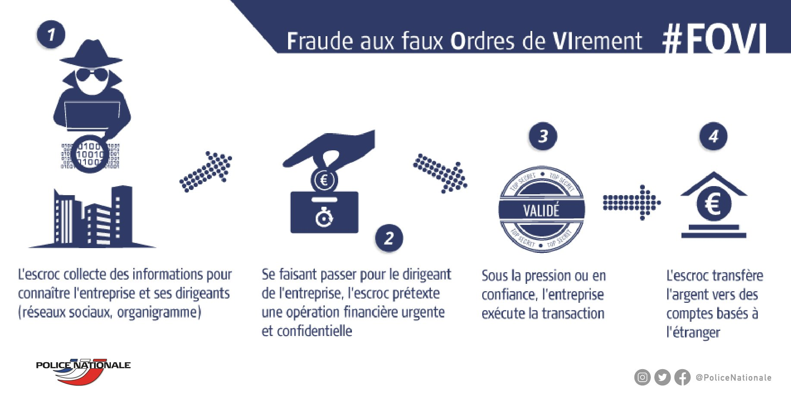
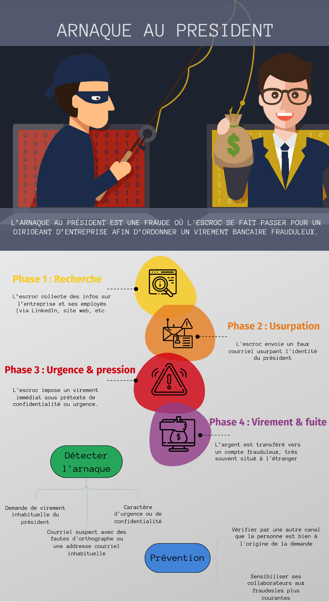
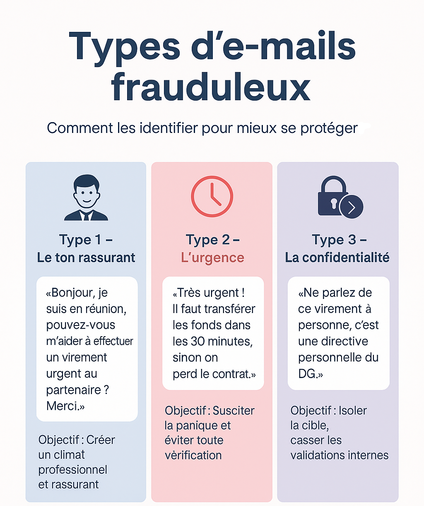
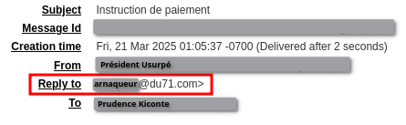
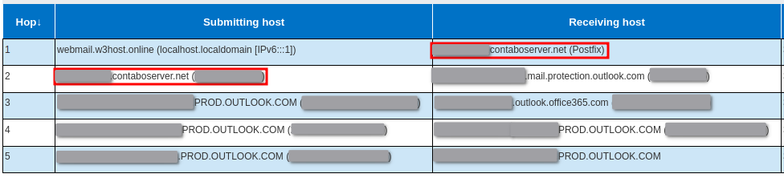
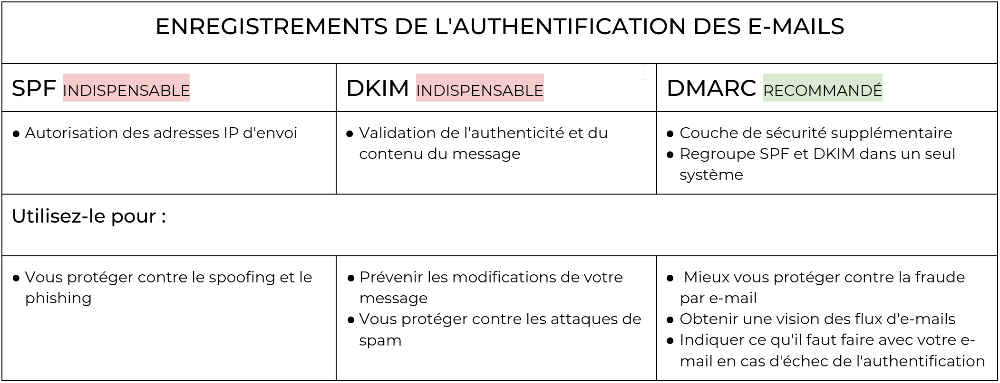

# Arnaque au président 

## Cas concrets

Les arnaques au président représentent aujourd’hui une menace réelle et croissante pour toutes les organisations, qu’il s’agisse de TPE, de PME, d’entreprises de taille intermédiaire ou encore d’entités publiques. Les cybercriminels ciblent sans distinction, en exploitant des failles humaines ou organisationnelles.
Voici quelques exemples récents qui illustrent l’ampleur, la diversité et la sophistication de ces escroqueries :

- Mai 2024 – Finistère : Une entreprise agroalimentaire locale a été victime d’un faux ordre de virement. Une collaboratrice, persuadée d’obéir à une consigne urgente émanant de la direction, a effectué un virement de 65 000 euros. 

[https://www.francebleu.fr/infos/faits-divers-justice/finistere-une-entreprise-agroalimentaire-victime-d-une-arnaque-au-president-2600174](https://www.francebleu.fr/infos/faits-divers-justice/finistere-une-entreprise-agroalimentaire-victime-d-une-arnaque-au-president-2600174)

- Avril 2025 – Isère : Une société iséroise a transféré 900 000 euros à une entreprise polonaise, croyant répondre à une demande officielle.
  
[https://www.ledauphine.com/faits-divers-justice/2025/04/19/faux-ordres-de-virement-les-petites-mains-d-une-escroquerie-a-900-000-euros-jugees](https://www.ledauphine.com/faits-divers-justice/2025/04/19/faux-ordres-de-virement-les-petites-mains-d-une-escroquerie-a-900-000-euros-jugees)

- Avril 2025 – Tours : Des particuliers ont été piégés et ont versé plus de 27 000 euros à un escroc ayant falsifié une facture de travaux. L’arnaque s’est faite par l’interception d’un courriel et la modification des coordonnées bancaires du maçon.

[https://www.lanouvellerepublique.fr/indre-et-loire/commune/joue-les-tours/escroquerie-au-faux-rib-a-tours-un-hacker-leur-derobe-27-000-en-falsifiant-les-coordonnees-bancaires-de-leur-macon-1743629991](https://www.lanouvellerepublique.fr/indre-et-loire/commune/joue-les-tours/escroquerie-au-faux-rib-a-tours-un-hacker-leur-derobe-27-000-en-falsifiant-les-coordonnees-bancaires-de-leur-macon-1743629991)

## Vue d’ensemble

L'arnaque au président est une forme d'ingénierie sociale où l'escroc cherche à obtenir un gain financier ou à accéder à des informations sensibles en se faisant passer pour le président d'une entreprise.

L’ingénierie sociale englobe un ensemble de techniques de manipulation psychologique visant à inciter une personne à divulguer des informations sensibles, à réaliser une action contre son intérêt, ou à contourner des mécanismes de sécurité, souvent sans en avoir conscience. Elle repose principalement sur un abus de confiance : l'escroc se fait passer pour une personne légitime (collègue, technicien, autorité, etc.) ou crée un contexte qui inspire faussement la confiance, afin d’exploiter les réactions humaines comme la peur, l’urgence, la curiosité ou la bienveillance.

> L'abus de confiance est le fait pour une personne, à qui vous avez remis volontairement de l'argent ou un bien, d'en détourner l'usage à son profit ou de l'utiliser frauduleusement.
>
> *Source : [https://www.service-public.fr/particuliers/vosdroits/F1515](https://www.service-public.fr/particuliers/vosdroits/F1515)*

Dans le contexte de l'arnaque au président, l'escroc se fait passer pour une personne de confiance, très souvent le président d'une société, afin de prendre contact avec des employés pour que ces derniers effectuent les actions requises par l'escroc. Par exemple, ce dernier peut demander la mise en place d'un virement vers un compte à l'étranger. Ce type de fraude est connu sous le nom d’escroquerie aux faux ordres de virement (FOVI), qui constituera le cœur de cet article.

Pour se prémunir contre cette menace, il est important de sensibiliser ses collaborateurs à ce type d'escroquerie, mais aussi de mettre en place des processus qui permettent un suivi et une validation stricte de ce type de demandes.

Si l'arnaque réussit, il est important de conserver les preuves afin de permettre le bon déroulement de l'investigation et, le cas échéant, la récupération des fonds dans la mesure du possible.

## Mode opératoire 

### 1. Identifier la cible de l'arnaque

Afin d'identifier une entreprise d'intérêt et ses employés, l'escroc va venir collecter des informations sur sa cible grâce à des recherches : 
- sur les réseaux sociaux tels que LinkedIn
- sur le site Internet de l'entreprise
- via des outils qui vont permettre de rechercher des adresses courriel, des numéros de téléphone, etc.

Durant cette phase de reconnaissance, l'objectif est
1. d'identifier un directeur général ou des membres de la direction afin d'usurper leur identité de manière crédible. 

2. d'identifier les victimes qui recevront le courriel d'arnaque (des personnes du service financier en capacité d'effectuer des virements, des personnes du service informatique en possession d'informations sensibles, etc)

### 2. Se faire passer pour le président 

L'escroc a plusieurs possibilités :

a. **En usurpant son identité grâce à une falsification de l'adresse courriel du président.** 

Cette technique est appelée usurpation d’identité électronique (ou spoofing). Le spoofing peut falsifier :

- le nom de l'expéditeur pour qu’une identité connue ou de confiance s’affiche, masquant ainsi la véritable origine du message
- l'adresse courriel en elle-même, afin de faire apparaître l'adresse courriel du président tout en intégrant une adresse de réponse différente

Cette falsification peut devenir plus aisée en l'absence de mécanismes de sécurité tels que SPF, DKIM ou DMARC (*ces éléments sont présentés ultérieurement*)

b. **En usurpant son identité grâce à une compromission de boîte courriel**  

Un escroc peut, en amont, chercher à compromettre une boîte courriel ou à acheter des authentifiants d'une boîte courriel compromise d'intérêt. Cela permet de 
- renforcer l'aspect légitime de l'arnaque car le courriel provient d'une entité interne
- d'obtenir des informations précieuses comme le carnet des contacts, l'agenda du collaborateur, le contenu de courriels, etc.

c. **En usurpant son identité via un appel téléphonique ou via un message**

Afin de renforcer l'aspect légitime d'un courriel frauduleux, un escroc peut appeler en amont la victime en se faisant passer pour le président.  Cette technique, appelée spoofing vocal, est de plus en plus exploitée pour convaincre les victimes d’exécuter des transactions urgentes. Grâce à des logiciels, l’escroc peut également usurper un numéro de téléphone, ce qui permet de faire apparaître le numéro d’un dirigeant ou d’un service interne de l’entreprise, renforçant ainsi la crédibilité de son appel.

D’autres canaux sont aussi utilisés, comme WhatsApp, Telegram ou Signal, où l’identité de l’émetteur est difficile à vérifier si le numéro n’est pas déjà connu de la victime. Enfin, avec les progrès de l’intelligence artificielle, certains outils permettent désormais d’imiter la voix d’un dirigeant, rendant les appels frauduleux encore plus convaincants.

### 3. Envoi du courriel d'arnaque

L'objectif primaire de ces arnaques est de détourner de l'argent. Ces escroqueries se nomment "Faux Ordres de Virement" (FOVI).

En se faisant passer pour le président d'une société, un escroc va inciter un employé à effectuer un virement bancaire vers un compte contrôlé par l'escroc.
Une fois les cibles identifiées, l'arnaqueur peut passer à l'envoi du message d'arnaque.

Voici un exemple de message où le ton reste formel mais génère tout de même une pression implicite :

    Bonjour [Nom de la victime],

    Nous devons effectuer un paiement à une entreprise en <Pays étranger>. Êtes-vous disponible pour le gérer maintenant ?

    Cordialement,
    [Nom du président]

Ici, l'arnaqueur semble vouloir tout d'abord nouer une relation de confiance en adoptant un ton poli et en omettant le relevé d'identité bancaire.

L'escroc peut aussi formuler un message où l'urgence est explicite : 

    Bonjour [Nom de la victime],

    Je suis actuellement en réunion et j'ai besoin que vous effectuiez un virement immédiat vers un fournisseur. Le montant est de xx € et il doit être effectué aujourd'hui pour finaliser un contrat très important.

    Voici les coordonnées bancaires du bénéficiaire : [Coordonnées bancaires]

    Confirme-moi dès que le virement est effectué. Merci de votre réactivité.

    Cordialement,
    [Nom du président]

Ou bien invoquer une situation de confidentialité :

    Bonjour [Nom de la victime],

    J'ai besoin que tu transfères de toute urgence xx € pour une opération stratégique. C'est très important pour notre entreprise, et il est crucial que tu fasses cela immédiatement.

    Comme je suis en déplacement, je vous prierai de ne pas en discuter avec d'autres personnes de l'équipe. Vous avez toute ma confiance.

    Voici les informations bancaires à utiliser : [Coordonnées bancaires]

    Merci de confirmer une fois le virement effectué.

    Cordialement,
    [Nom du président]

Tous ces exemples mettent en avant une situation d'urgence et imposent la confiance grâce à l'usurpation de l'identité d'une personne de confiance.

### En résumé

## Cas concret : NoPay Corp

Chez AISI, nous avons mené une investigation chez le client NoPay Corp après que ces derniers ont vu leurs comptables recevoir un courriel du président demandant un virement vers une entreprise au Scambodia.

Notre comptable ciblée se nomme Prudence KICONTE

Le courriel d'arnaque était le suivant :

    Bonjour Prudence,

    Nous devons effectuer un paiement à une entreprise au Scambodia. Êtes-vous disponible pour le gérer maintenant ?

    Cordialement,
    Président Usurpé

Grâce à la bonne sensibilisation de ses utilisateurs, NoPay Corp ne sera pas victime de cette arnaque. 

L'investigation montrera que l'arnaqueur a usurpé l'adresse courriel de Président Usurpé sans compromettre sa boîte courriel.

### Investigation

L'analyse a débuté avec un élément manquant : **le courriel d'arnaque**. L'investigation s'est donc basée sur les éléments présents dans une capture d'écran prise par NoPay Corp : un horodatage, des destinataires et des expéditeurs ainsi que le corps du message.

Durant l'investigation, les premiers éléments vérifiés ont été les mécanismes de sécurité sur les courriels (DMARC, SPF et DKIM). L'absence de DMARC a ainsi été confirmée, signifiant que la légitimité du domaine de l'expéditeur ne peut être vérifié. Cela nous a permis d'explorer une première piste : **l'usurpation de l'adresse courriel du président**.

Pour confirmer cette usurpation, l'analyse des journaux d'évènements de l'environnement Microsoft a été nécessaire. Plus précisément, les journaux relatifs à l'envoi des courriels où l'artefact se nomme **Send** et les logs de connexion afin de détecter une connexion suspecte qui pourrait indiquer la compromission de la boîte courriel.

En tenant compte des horodatages et grâce aux éléments collectés sur l'environnement Microsoft, il a été possible de confirmer deux choses : 
1. Aucun courriel n'a été envoyé depuis l'adresse de Président Usurpé sur le temps indiqué par les horodatages 
2. Aucune connexion malveillante n'a été observée au compte de Président Usurpé

Ces éléments solidifient l'hypothèse d'usurpation de l'adresse courriel.

Par la suite, AISI a réussi à récupérer les en-têtes du courriel d'arnaque grâce à la console Microsoft Defender. L'analyse de ces dernières montrera 

1. Une adresse de réponse différente de celle de l'expéditeur identifié comme Président Usurpé : 

*Notez également l'heure de création inhabituelle.*

2. Un courriel émis depuis un serveur étranger externe à l'entreprise : 

### Réaction de Prudence KICONTE

Durant l'investigation menée, il a été observé une excellente réaction de Prudence KICONTE : elle a immédiatement remonté le courriel à son service informatique. 

Grâce à cette action rapide, aucun virement n'a été effectué par NoPay Corp.

Une investigation pour déterminer l'origine de l'arnaque a pu sereinement débuter et les impacts générés ont été fortement limités.

### Leçons à retenir de cet incident 

- La sensibilisation des utilisateurs est essentielle pour se prémunir de ce type d'arnaque.
  
- Conserver le courriel d'arnaque facilite une investigation et étoffe le dépôt de plainte 

## Bons réflexes et contre-mesures

### Bons réflexes

> ⚠️ **Conservez le courriel frauduleux : il constitue une preuve indispensable pour les investigations.** ⚠️

Si un utilisateur reçoit un courriel frauduleux sans y répondre : 

  - [x] Conserver le message en l'état (ne pas le supprimer)
   
  - [x] Investiguer sur sa provenance pour déterminer s'il s'agit 
    - d'une compromission de boîte courriel
    - d'un spoofing 

Si un utilisateur a reçu un courriel d'arnaque et a donné suite : 

  - [x] Contacter immédiatement la banque pour signaler l’arnaque et tenter de bloquer ou de récupérer les fonds

  - [x] Conserver le courriel frauduleux comme preuve

  - [x] Investiguer sur sa provenance pour déterminer s'il s'agit 
     - d'une compromission de boîte courriel
     - d'un spoofing 

### Contre-mesures en cas de compromission

Si une compromission de compte est confirmée, les actions suivantes doivent être menées :

1. au niveau du compte de l'utilisateur compromis :
   - [x] Réinitialiser le mot de passe
   - [x] Supprimer les applications suspectes récemment ajoutées dans Azure AD / Entra ID
   - [x] Supprimer les appareils de confiance inconnus
   - [x] Vérifier que l’authentification multifacteur (MFA) est bien activée
   - [x] Réinitialiser les tokens OAuth (ils permettent le maintien d'une session active sans avoir à se reconnecter)

2. au niveau de la boîte courriel :
   - [x] Supprimer les redirections de boîte courriel suspectes
   - [x] Supprimer les règles suspectes récemment ajoutées ou modifiées
   - [x] Analyser les courriels envoyés depuis la boîte compromise

### Actions en cas de spoofing

Le spoofing est une technique d’usurpation d’adresse courriel, souvent utilisée pour contourner les protections et duper le destinataire.

Pour limiter ces attaques, il est essentiel de configurer correctement les mécanismes SPF, DKIM et DMARC.

Il est également possible de mettre en place

- [x] Un filtrage anti-spam avancé capable de détecter les comportements suspects, les anomalies dans les en-têtes, et les tentatives d’usurpation

- [x] Des sessions de formation et de sensibilisation des utilisateurs pour apprendre à reconnaître les signes d’un email usurpé

- [x] Des mécanismes de validation lors de la modification d'une empreinte bancaire ou lors de l'envoi de sommes importantes.

## Renforcer son environnement Entra ID/Azure AD

Dans un contexte d'augmentation des fraudes numériques ciblant les entreprises et leur environnement Microsoft, il est essentiel de sécuriser Entra ID / Azure AD face aux attaques par phishing, détournement d'applications ou accès non autorisés. Ce guide vous propose des recommandations concrètes, accompagnées de procédures officielles, pour renforcer votre posture de sécurité.

L'ensemble des liens clickables ci-dessous renvoient aux procédures officielles Microsoft.

### Utiliser des solutions MFA résistantes au phishing​

- Privilégier des méthodes comme des clés de sécurité physiques ([FIDO2](https://support.microsoft.com/fr-fr/account-billing/configurer-une-cl%C3%A9-d-acc%C3%A8s-fido2-comme-m%C3%A9thode-de-v%C3%A9rification-2911cacd-efa5-4593-ae22-e09ae14c6698)) ou des applications d'authentification qui ne dépendent pas uniquement de codes OTP (One-Time Password) transmis via SMS ou courriel ([Microsoft Authenticator](https://learn.microsoft.com/fr-fr/entra/identity/authentication/concept-authentication-authenticator-app) par exemple).​

- Limiter la durée de vie du jeton MFA à 24h via les politiques de Conditional Access pour [contrôler la fréquence de réauthentification](https://learn.microsoft.com/fr-fr/entra/identity/authentication/concepts-azure-multi-factor-authentication-prompts-session-lifetime)

- [Bloquer les authentifications héritées](https://learn.microsoft.com/fr-fr/entra/fundamentals/security-defaults#block-legacy-authentication-protocols) (Legacy Authentication) en désactivant les protocoles anciens comme IMAP, POP3 et SMTP AUTH, car ils ne supportent pas les mécanismes modernes d'authentification MFA.​
### Gestion des jetons

Microsoft recommande l'utilisation de CAE pour remplacer les stratégies de durée de vie des jetons dans les environnements modernes. CAE garantit que les jetons restent valides aussi longtemps que certaines conditions sont respectées (par exemple, la session utilisateur est sécurisée), mais deviennent invalides immédiatement si :

- L’utilisateur change son mot de passe.
- Une politique d’accès conditionnel modifie les règles.
- Une session suspecte est détectée.

[CAE](https://learn.microsoft.com/fr-fr/entra/identity/conditional-access/concept-continuous-access-evaluation) est activé par défaut sur tous les nouveaux tenants Azure. Il n'y a donc pas besoin de configurer explicitement cette option, sauf si elle a été désactivée.

### Déployer des politiques d'accès conditionnel 

Grâce à Azure Conditional Access, il est possible de mettre en place des règles de sécurité contextuelles pour contrôler l'accès aux ressources selon :​

- L'emplacement géographique.​

- L’état du périphérique (géré, conforme, hybride, etc.).

- Les comportements inhabituels (Microsoft Cloud Defender uniquement)

La procédure officielle Microsoft est disponible [ici](https://learn.microsoft.com/fr-fr/entra/identity/conditional-access/policy-block-by-location).

*Exemples de politiques Conditional Access* : 

| Nom | Description | Niveau de sécurité | Impact production |
| --- | ----------- | --------------- | ------------- |
| Facilitation | Activation du MFA pour tous les utilisateurs sauf si ceux-ci sont au bureau | moyen | faible |
| Restriction par pays | seules les adresses IP situées en France peuvent s'authentifier | fort | faible |
| Restriction par IP | seules les adresses IP provenant de bureaux de l'entreprise peuvent s'authentifier | très fort | fort |
| Restriction de conformité | si un utilisateur réalise des actions à risque, ou que l'utilisateur ne remplit pas les exigences de conformités, il est automatiquement bloqué | fort | moyen |

### Restrictions des applications 

1. En bloquant le consentement utilisateur global

Par défaut, les utilisateurs peuvent consentir à des applications tierces qui demandent des permissions "non sensibles". Cette configuration est souvent exploitée par un attaquant afin de consentir à une application indésirable.​

Il est ainsi recommandé de ne pas laisser les utilisateurs consentir à ce que les applications accèdent aux données de l'entreprise en leur nom.

La procédure officielle Microsoft est disponible [ici](https://learn.microsoft.com/fr-fr/entra/identity/enterprise-apps/configure-user-consent#configure-user-consent-settings).

2. En activant l'approbation administrative 

Il est possible d'activer un flux d’approbation administrateur. Si un utilisateur tente d'accéder à une application nécessitant des autorisations, un message de blocage s’affiche avec un bouton pour envoyer une demande d’approbation à l’administrateur désigné.

La procédure officielle Microsoft est disponible [ici](https://learn.microsoft.com/fr-fr/entra/identity/enterprise-apps/configure-admin-consent-workflow).

### Revoir et limiter les permissions des applications​

- Régulièrement auditer les applications enregistrées dans Azure AD et des permissions qu’elles demandent.​

- Vérifier les applications ayant des permissions sensibles comme Directory.ReadWrite.All ou User.ReadWrite.All.

Pour faire cela, l'outil de Crowdstrike [CRT](https://www.crowdstrike.com/en-us/resources/community-tools/crt-crowdstrike-reporting-tool-for-azure/) (CrowdStrike Reporting Tool for Azure) peut être utilisé. Ce dernier permet d'examiner rapidement et facilement les autorisations excessives dans les environnements Azure AD pour aider à déterminer les faiblesses de la configuration et fournir des conseils pour atténuer ce risque.

## Quelques ressources pour vous accompagner 

Cybermalveillance : [https://www.cybermalveillance.gouv.fr/tous-nos-contenus/fiches-reflexes/escroquerie-faux-ordres-virement-fovi](https://www.cybermalveillance.gouv.fr/tous-nos-contenus/fiches-reflexes/escroquerie-faux-ordres-virement-fovi)

CollectiviteLocales.gouv.fr : [https://www.collectivites-locales.gouv.fr/finances-locales/lutte-contre-les-tentatives-descroquerie](https://www.collectivites-locales.gouv.fr/finances-locales/lutte-contre-les-tentatives-descroquerie)

Ministère de l'économie : [https://www.economie.gouv.fr/files/files/directions_services/dgccrf/documentation/publications/depliants/guide-des-arnaques-task-force.pdf#page=8&zoom=auto,-5,659](https://www.economie.gouv.fr/files/files/directions_services/dgccrf/documentation/publications/depliants/guide-des-arnaques-task-force.pdf#page=8&zoom=auto,-5,659)

## Checklist de sécurité à télécharger

### En cas de réception d’un courriel suspect

- [ ] Ne pas répondre au message
- [ ] Ne pas supprimer le courriel (il est une preuve)
- [ ] Transférer le courriel à l’équipe sécurité
- [ ] Lancer une enquête interne pour déterminer :
  - [ ] S’il y a eu compromission
  - [ ] Ou simple spoofing
---

### En cas de réponse donnée au courriel frauduleux

- [ ] Contacter immédiatement la banque
- [ ] Conserver tous les messages échangés

---

### Si un compte a été compromis

#### ➤ Compte utilisateur
- [ ] Réinitialiser le mot de passe
- [ ] Supprimer les applications suspectes dans Entra ID
- [ ] Révoquer les appareils inconnus
- [ ] Vérifier l’activation du MFA
- [ ] Réinitialiser les jetons OAuth

#### ➤ Boîte courriel
- [ ] Supprimer les redirections suspectes
- [ ] Supprimer les règles de messagerie non légitimes
- [ ] Examiner les courriels envoyés

---

### En cas de spoofing (usurpation d'adresse courriel)

- [ ] Vérifier SPF / DKIM / DMARC
- [ ] Activer un filtrage anti-spam avancé
- [ ] Sensibiliser les utilisateurs
- [ ] Mettre en place des procédures de validation :
  - [ ] Changement de coordonnées bancaires
  - [ ] Validation en amont des virements

---

### Bonnes pratiques générales

- [ ] Activer l’authentification multifacteur (MFA) (clé FIDO2 ou Authenticator)
- [ ] Bloquer les protocoles obsolètes (IMAP, POP, SMTP AUTH)
- [ ] Restreindre le consentement aux applications
- [ ] Déployer des politiques d'accès conditionnel 
- [ ] Auditer régulièrement les permissions applicatives
