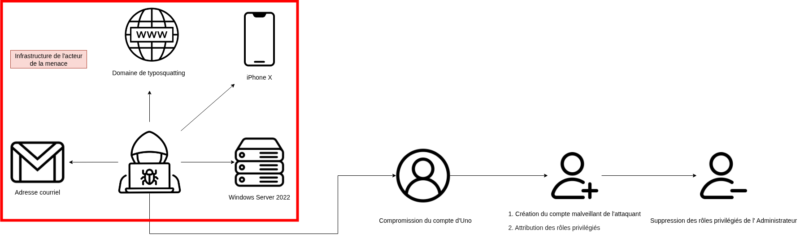
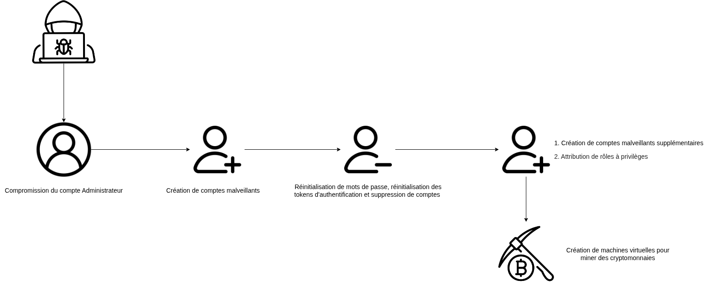
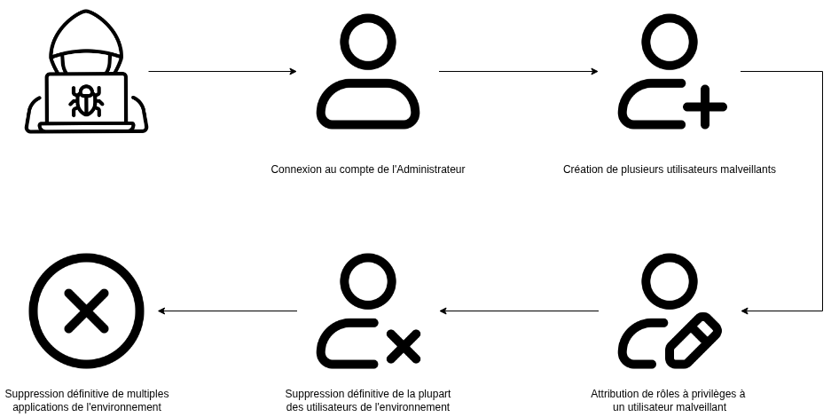
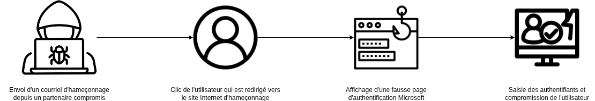

# Contexte 

Les attaques cyber ne relèvent plus de l’hypothèse : elles font désormais partie du paysage des risques auxquels toute organisation doit faire face. Leur impact ne se limite pas aux systèmes informatiques : il touche directement la continuité d’activité, la confiance des partenaires et, de plus en plus souvent, la réputation de la société.

Ces dernières années, les attaques contre des entreprises reconnues ont montré que la notoriété ou la taille ne suffisent plus à protéger. Certaines ont perdu des semaines d’activité, d’autres ont dû annoncer publiquement des pertes chiffrées en millions d’euros. Toutes ont vu leur image questionnée, parfois durablement. **Ces incidents, largement relayés dans les médias, seront au cœur de la première partie de cette article.**

Les chiffres parlent d’eux-mêmes : en quelques heures, une intrusion peut paralyser une activité, faire chuter la confiance des clients ou fragiliser durablement l’image d’un dirigeant. Dans ce contexte, la question n’est plus tant de savoir si l’entreprise sera visée, mais comment elle y répondra.

Au-delà de la technologie, c’est la posture de la direction qui détermine souvent l’issue de la crise. Face à une cyberattaque, deux scénarios se dessinent : celui d’une crise anticipée, gérée avec méthode et transparence, ou celui d’une panique désorganisée qui amplifie les dégâts. 

Assumer son incident, c’est démontrer sa maturité. Les entreprises les mieux préparées savent que la cybersécurité n’est pas une affaire purement technique : c’est un enjeu stratégique. Car finalement, ce n’est pas le fait d’être attaqué qui distingue les entreprises, mais la manière dont leurs dirigeants gèrent et assument la situation. **C'est ainsi que nous aborderons, dans un second temps, plusieurs incidents concrets survenus au sein d’AISI et les enseignements qui en ont été tirés.**

# Démonstration de compromissions ayant eu un impact financier et réputationnel vus dans la presse

Les incidents que nous allons examiner illustrent concrètement comment une cyberattaque peut se transformer en crise financière et réputationnelle. Certains incidents sont liés à des vulnérabilités techniques ignorées, d’autres à des erreurs humaines ou à des stratégies de fraude sophistiquées.

Ces exemples, largement relayés dans la presse, permettent de tirer des enseignements précieux : ils montrent que l’impact d’une attaque ne se limite pas aux systèmes informatiques, mais touche directement la continuité d’activité, la confiance des clients et des partenaires mais également la réputation de l’entreprise.

## Incident – Optical Center

Juin 2018, un incident public ayant concerné Optical Center illustre parfaitement les conséquences d’une compromission de données amplifiée par une vulnérabilité connue mais non corrigée.

Optical Center a été victime d’une faille sur son site e-commerce permettant à des utilisateurs d’accéder aux factures d’autres clients en modifiant simplement l’URL. Cette vulnérabilité, identifiée mais ignorée, a exposé près de 200 000 données personnelles, dont des informations sensibles.

La CNIL a sanctionné l’entreprise par une amende de 250 000 €, confirmée par le Conseil d’État, mettant en lumière le coût financier direct d’une telle compromission. Il est reproché à Optical Center de ne pas avoir contrôlé régulièrement les mesures de sécurité techniques et organisationnelles mises en œuvre par son sous-traitant chargé d'assurer la sécurité du site Internet. Il a également été indiqué que les mots de passe n'étaient pas assez robustes au regard de la sensibilité des données en jeu.

Au-delà de l’aspect économique, l’incident a eu un impact réputationnel majeur, compromettant la confiance des clients et affectant l’image de la marque.

Les enseignements à tirer de cet incident sont :

---

1. **La supervision des vulnérabilités connues**

Ignorer une faille identifiée multiplie le risque et amplifie les conséquences financières et réputationnelles.

Il faut donc : 
- Identifier et suivre les vulnérabilités connues
- Prioriser les failles selon leur importance
- Sensibiliser les équipes à l’importance de corriger rapidement les failles
- Rapports périodiques à la direction sur le niveau de risque

Le pilotage et la priorisation des vulnérabilités au plus haut niveau, associés à un suivi rigoureux, permettent de maîtriser les risques et de prévenir les incidents majeurs.

---
  
2. **La réactivité et la prévention**

L’absence de réactivité face aux vulnérabilités et le manque d’anticipation transforment des failles techniques maîtrisables en incidents de sécurité aux conséquences étendues.

Il faut donc : 
- Réaliser des audits de sécurité réguliers
- Maintenir à jour les systèmes
- Former et sensibiliser les équipes aux risques de sécurité
- Processus de correction rapide documenté et suivi

La mise en place d’audits réguliers, la correction rapide des vulnérabilités et la sensibilisation des équipes permettent de limiter l’impact d’une compromission.

---

*Sources* :

- [TF1](https://www.tf1info.fr/high-tech/protection-des-donnees-personnelles-amende-de-250-000-euros-a-l-encontre-d-optical-center-infligee-par-la-cnil-2089878.html)
- [Osborne Clarke](https://www.osborneclarke.com/fr/insights/cyberfaille-de-securite-le-conseil-detat-francais-confirme-la-decision-de-la-cnil-contre)

---

## Incident - Deloitte 

En 2017, Deloitte a été victime d’une compromission ayant exposé des documents confidentiels de clients stockés sur son environnement Microsoft Azure. L’accès aurait été obtenu via un compte administrateur dépourvu d’authentification à deux facteurs, offrant un accès étendu aux courriels et fichiers internes. Si l’accès technique aux données sensibles et privées est problématique, le véritable impact de l’incident a été réputationnel.

En effet, les communications officielles de Deloitte ont rapidement été contestées par des utilisateurs et des observateurs sur des forums publics, notamment Reddit. L’entreprise avait initialement minimisé l’incident en affirmant que seules certaines données « non sensibles » avaient été exposées et que l’accès aux informations confidentielles avait été limité. Or, des utilisateurs ont affirmé, preuves à l'appui, que des documents sensibles de clients étaient bel et bien accessibles, contredisant ainsi les communications officielles de Deloitte jugées incomplètes ou inexactes.

Cette contradiction entre les déclarations officielles et les faits observables a immédiatement semé le doute parmi les clients et partenaires, amplifiant la perte de confiance. Ces contradictions ont nourri l’impression d’un manque de maîtrise, compliquant la gestion de crise et transformant un incident technique en crise réputationnelle majeure.

En conséquence, l’incident est devenu beaucoup plus coûteux pour Deloitte sur le plan de l’image, dépassant largement l’impact strictement technique de la compromission initiale.

Les enseignements à tirer de cet incident sont :

---

1. **La communication est critique**

Des messages contradictoires ou incomplets aggravent l’impact réputationnel d’un incident et entament la confiance des clients et partenaires.

Il faut donc :
- Définir un plan de communication de crise clair
- Identifier les porte-paroles et leurs responsabilités
- Préparer des messages types pour différents scénarios
- Vérifier que les informations transmises sont cohérentes et validées

Une communication structurée et cohérente permet de limiter l’impact réputationnel et de maintenir la confiance des parties prenantes.

---

2. **Réactivité et transparence**

L’absence de réactivité ou de transparence peut conduire à l'amplification des conséquences d’un incident.

Il faut donc :
- Mettre en œuvre des canaux de communication rapides et fiables
- Préparer les équipes à réagir immédiatement en cas d’incident
- Assurer un suivi régulier des messages diffusés pour garantir exactitude et cohérence
- Combiner communication transparente et mesures techniques pour limiter l’impact

Une communication rapide et transparente permet de maîtriser l’incident et de réduire ses conséquences réputationnelles.

---

*Sources* : 
- [Le Monde Informatique](https://www.lemondeinformatique.fr/actualites/lire-deloitte-pirate-des-documents-confidentiels-clients-derobes-69479.html) 
- [The Guardian](https://www.theguardian.com/business/2017/sep/25/deloitte-hit-by-cyber-attack-revealing-clients-secret-emails)

## Incident - Saint Gobain

Saint-Gobain a été victime en juin 2017 de l’attaque NotPetya, un logiciel malveillant de type wiper, dont l'objectif était de détruire les données et de paralyser les systèmes informatiques. Si l’impact technique sur les systèmes informatiques a été immédiat et évident, le coût principal pour l’entreprise a été financier et opérationnel.

Même si Saint-Gobain indiquait déjà disposer d’un dispositif de sécurité structuré et avoir réagi rapidement, l’ampleur de l’attaque a révélé les limites de leur préparation face à une menace aussi destructrice. L’infection provenait d’un logiciel tiers utilisé en Ukraine dont la compromission a entraîné l’arrêt temporaire de nombreuses activités industrielles et logistiques, provoquant des perturbations majeures dans la production et la distribution. Le groupe a estimé le coût total entre 220 et 250 millions d’euros, dont 80 millions directement imputables au résultat d’exploitation. Les réseaux informatiques ont dû être redémarrés, entraînant des coûts supplémentaires de reprise d’activité et des retards opérationnels significatifs.

Saint-Gobain s’est distingué par sa transparence et sa rigueur dans la communication de crise. Le groupe a publié des mises à jour officielles, notamment un communiqué intitulé “Cyber-attack: return to normal operations” le 13 juillet 2017, indiquant son retour progressif à la normale. Cette posture ouverte, combinée à l’intégration du coût dans ses résultats financiers, a contribué à préserver la confiance des parties prenantes malgré l’ampleur de la crise. 

À la suite de l’incident, Saint-Gobain a renforcé en profondeur son dispositif de cybersécurité. Le groupe a revu sa gouvernance du risque numérique, accru les investissements dans la segmentation des réseaux, la supervision en temps réel et la sauvegarde des données critiques. Des programmes de sensibilisation à la sécurité ont également été déployés auprès de l’ensemble des collaborateurs et partenaires. Ces initiatives visent à renforcer la résilience du groupe face aux menaces futures et à ancrer durablement la cybersécurité dans sa culture d’entreprise.

Les enseignements à tirer de cet incident sont :

---

1. **Préparation et continuité opérationnelle**

L’absence de plans de continuité d’activité et de sauvegardes testées peut accentuer les pertes financières et opérationnelles lors d’attaques massives.

Il faut donc : 
- Élaborer et maintenir des plans de continuité d’activité à jour
- Mettre en place des sauvegardes régulières et testées
- Identifier les processus critiques et prévoir des solutions alternatives
- Tester régulièrement la capacité de reprise opérationnelle

Des plans de continuité robustes et des sauvegardes fiables permettent de maintenir l’activité et de limiter l’impact financier et opérationnel d’un incident majeur.

---

1. **Investissement dans la cybersécurité proactive**

La négligence des systèmes critiques ou l’absence de tests réguliers augmente le risque de propagation et les dommages causés par des attaques sophistiquées.

Il faut donc :
- Sécuriser les systèmes et applications critiques
- Réaliser des tests réguliers d'intrusion et audits de sécurité
- Détecter et corriger rapidement les failles avant qu’elles ne soient exploitées
- Allouer des ressources suffisantes à la cybersécurité préventive

Un investissement proactif dans la cybersécurité permet de réduire la vulnérabilité des systèmes et de limiter l’impact opérationnel et financier des incidents.

---

*Sources :*
- [Le Monde Informatique](https://www.lemondeinformatique.fr/actualites/lire-saint-gobain-evalue-a-250-meteuro-les-degats-lies-a-l-attaque-notpetya-68955.html)
- [Usine Nouvelle](https://www.usinenouvelle.com/editorial/chez-saint-gobain-il-y-un-avant-et-un-apres-la-cyber-attaque.N651134)

## Incident - NP Logistics

KNP Logistics, une entreprise britannique de transport fondée en 1865, a été victime d'une cyberattaque dévastatrice en juin 2023. Un mot de passe faible, facilement deviné par les attaquants, a permis à un groupe de la menace d'accéder aux systèmes internes de l'entreprise. Une fois à l'intérieur, les cybercriminels ont chiffré toutes les données critiques et verrouillé les systèmes essentiels, paralysant ainsi l'ensemble des opérations.

Malgré des infrastructures informatiques conformes aux normes de l'industrie et une assurance contre les cyberattaques, KNP n'a pas pu se remettre de l'attaque. Les sauvegardes et les systèmes de reprise après sinistre ont également été compromis. Face à une demande de rançon estimée à 5 millions de livres sterling (environ 5,82 millions d’euros), l'entreprise a été contrainte de fermer ses portes, mettant ainsi fin à 158 ans d'activité et laissant 700 employés sans emploi.

Les enseignements à tirer de cet incident sont :

---

1. **La sécurité des mots de passe et des comptes critiques**

Un mot de passe faible ou mal géré peut suffire à compromettre l’ensemble des systèmes d’une entreprise.

Il faut donc :
- Mettre en place des mots de passe forts et uniques pour tous les comptes critiques
- Utiliser des procédures d’authentification renforcée pour les accès sensibles
- Vérifier régulièrement que les comptes à privilèges sont correctement protégés
- Prévoir des mécanismes de récupération sécurisés en cas de perte d’accès

Une gestion rigoureuse des mots de passe et des comptes critiques permet de prévenir les compromissions et de protéger l’entreprise contre des attaques dévastatrices.

---

3. **Impact financier et humain direct**

L’absence de préparation opérationnelle et de plans de continuité peut conduire à la perte totale de l’entreprise et des emplois en cas de cyberattaque majeure.

Il faut donc :
- Identifier les processus critiques et évaluer les risques financiers et humains
- Élaborer des plans de continuité d’activité et de sauvegarde
- Sensibiliser les équipes à l’importance de la cybersécurité au quotidien
- Prévoir des scénarios de crise pour limiter les pertes en cas d’attaque

Des plans de continuité efficaces et une sensibilisation proactive permettent de réduire l’impact financier et humain des incidents et de préserver la pérennité de l’organisation.

---

*Sources:*
- [SOS Ransomware](https://sosransomware.com/ransomware/mot-de-passe-vulnerable-faillite-de-knp-le-cout-reel-d-un-ransomware/)
- [BBC](https://www.bbc.com/news/articles/cx2gx28815wo)

## Incident - Sefri-Cime

Sefri-Cime, un promoteur immobilier français, a été victime en décembre 2021 d’une arnaque au président sophistiquée, visant à extorquer des fonds à grande échelle. Bien que l’attaque n’ait pas affecté directement les systèmes informatiques, son coût financier a été massif.

L’escroquerie a été menée via des courriels usurpant l’identité du président et d’un avocat, incitant le comptable de l’entreprise à effectuer plus de quarante virements pour un total de 38 millions d’euros. Cette fraude a provoqué une perturbation majeure dans la trésorerie de l’entreprise et a fortement mobilisé les équipes pour tenter de récupérer les fonds.

La gestion de l’incident a mis en évidence l’importance de procédures internes strictes de contrôle des paiements et de vérification des ordres de virement : malgré la vigilance habituelle, l’ingéniosité des fraudeurs et le caractère urgent des demandes ont permis la réussite de l’attaque.

Les enseignements à tirer de cet incident sont :

---

1. **Vérification et gouvernance financière** 

L’absence de procédures strictes de contrôle des virements expose l’entreprise à des fraudes financières importantes, même sans compromission informatique.

Il faut donc : 
- Définir des procédures de contrôle et de validation pour toute transaction financière sensible
- Vérifier systématiquement les demandes inhabituelles ou urgentes
- Mettre en place une double validation pour les virements importants
- Effectuer des audits réguliers des processus financiers et de validation

Des procédures robustes de vérification et de gouvernance financière permettent de limiter le risque de fraude et de protéger les ressources de l’entreprise.

---

2. **Sensibilisation et formation du personnel**

La méconnaissance des techniques d’ingénierie sociale peut rendre les collaborateurs vulnérables à des escroqueries sophistiquées et provoquer des pertes financières majeures.

Il faut donc :
- Organiser des sessions de formation régulières sur la fraude et la manipulation par courriel ou téléphone
- Diffuser des rappels et supports pédagogiques simples et accessibles
- Réaliser des tests internes simulant des tentatives de fraude pour renforcer la vigilance
- Encourager une culture de signalement immédiat en cas de doute ou de comportement suspect

Une formation régulière et une sensibilisation continue du personnel permettent de détecter les tentatives de fraude et de protéger l’entreprise contre des pertes financières importantes.

---

*Sources:*
- [Face au risque](https://www.faceaurisque.com/2023/03/21/une-arnaque-au-president-fait-perdre-38-millions-d-euros-a-une-entreprise/)
- [Le Parisien](https://www.leparisien.fr/faits-divers/arnaque-au-president-huit-interpellations-apres-une-escroquerie-record-de-38-millions-deuros-17-02-2023-MH3JFA5FWZGX5IQVPJLIARKMQY.php)

---

# Démonstration de compromissions ayant eu un impact financier et réputationnel traités chez AISI

Chez AISI, nous avons constaté que l’ampleur des dégâts d’une cyberattaque dépend surtout de la rapidité de détection et de l’efficacité de la réponse. Une identification précoce permet de limiter significativement l’impact financier et opérationnel. La réactivité et la maturité sont également déterminantes : un collaborateur doit être capable d'identifier rapidement les signes d’alerte, alerter les bonnes parties prenantes et mobiliser efficacement les ressources appropriées.

En réponse à incident, la décision du management est cruciale : prendre des décisions fortes, comme isoler des systèmes compromis ou couper temporairement les connexions réseau, permet de contenir la menace et de limiter les conséquences opérationnelles tout en donnant le temps aux équipes forensiques de mener leur investigation.

En pratique, un incident détecté tôt et géré efficacement se traduit souvent par des pertes financières significativement réduites et un impact limité sur la continuité des activités. 

     
### Premier incident 

Chez AISI, nous avons traité un incident chez un particulier VIP, que nous nommerons **Uno**. 

**Uno** a pris contact avec AISI après que sa banque ait reçu une instruction de paiement frauduleuse. L'incident a révélé une compromission généralisée de l’environnement Microsoft, touchant plusieurs comptes à privilèges élevés. Cette situation a entraîné une perte totale du contrôle de l'environnement Microsoft, rendant impossible la poursuite immédiate de l’investigation.

Il aura fallu treize jours complets pour que **Uno** puisse rétablir l’accès et reprendre le contrôle de son environnement. 

Durant ces treize jours d’interruption, les activités ont dû être suspendues. Cette situation a non seulement paralysé l’ensemble des activités, mais a également engendré un impact réputationnel majeur : il a fallu avertir les partenaires via une boîte courriel de secours de ne pas tenir compte des courriel émis par **Uno**, l'adresse courriel principale de contact étant compromise.

Une fois le contrôle rétabli, les conséquences techniques de cette interruption se sont pleinement manifestées. La durée prolongée de l’incident a conduit à la perte partielle des journaux de sécurité, empêchant une reconstitution complète des actions de l’attaquant et limitant la compréhension du vecteur initial de compromission.

Cette lacune dans les données disponibles limite la capacité à reconstituer l’ensemble des actions menées par l’attaquant et ne permet pas d'identifier la manière dont le compte d'**Uno** a été compromis.

L’investigation a toutefois permis d’identifier que l’attaquant visait probablement à créer un domaine de typosquatting usurpant une banque, associé à une adresse courriel imitant une employée légitime, dans le but de mener des campagnes d’hameçonnage ciblées.

Les enseignements à tirer de cet incident sont :

---

**Protection des comptes critiques et reprise d’accès**

L’absence de sécurisation des comptes sensibles ou de mécanismes fiables de récupération peut entraîner des interruptions prolongées et compromettre la continuité des opérations.

Il faut donc :
- Renforcer la sécurité des comptes à privilèges et des accès critiques
- Mettre en œuvre des procédures de récupération d’accès testées et documentées
- Vérifier régulièrement que seuls les utilisateurs autorisés disposent des accès nécessaires
- Réaliser des revues périodiques des droits et des habilitations

La protection rigoureuse des comptes critiques et des mécanismes de reprise d’accès permet de limiter les interruptions et d’assurer la continuité des opérations en cas d’incident.

---

**Préparation de canaux de communication alternatifs**

L’absence de canaux de communication de secours peut accentuer l’impact réputationnel d’un incident et réduire la confiance des partenaires.

Il faut donc :
- Définir un plan de communication de crise avec des canaux hors ligne ou externes
- Identifier et former les porte-paroles habilités à communiquer en cas d’incident
- Mettre en place une cellule de coordination pour garantir la cohérence des messages
- Tester régulièrement l’efficacité des canaux de communication alternatifs

Des canaux de communication alternatifs efficaces permettent de maintenir la confiance des partenaires et de limiter l’impact réputationnel lors d’une compromission.

##  Deuxième incident 

Un deuxième incident pris en charge par AISI concerne une PME que nous appellerons **Dos**.

Dos a sollicité l’assistance d'AISI après avoir constaté, sur son environnement Microsoft Office 365, une compromission massive de comptes administrateurs entraînant la perte de contrôle de l’ensemble de son environnement Microsoft.

L’incident a débuté par la compromission d’un compte administrateur, permettant à l’attaquant de créer plusieurs comptes malveillants et de leur attribuer des droits étendus. Une fois en position de contrôle, l’attaquant a déclenché une vague de réinitialisation des mots de passe ainsi qu’une réinitialisation forcée de l’authentification multifacteur sur de nombreux comptes Office 365. Dans la même journée, il a procédé à la suppression de plusieurs comptes utilisateurs, entraînant une perte totale du contrôle de l’environnement Microsoft de l’entreprise.

L’analyse a révélé que le compte administrateur compromis n’a pas été ciblé par une attaque “brute force”, c’est-à-dire qu’il n’a pas subi de tentatives automatiques répétées de deviner le mot de passe. Cela suggère que l’attaquant disposait déjà du mot de passe légitime, probablement obtenu par une autre voie (exfiltration, réutilisation ou hameçonnage).

En parallèle, l’investigation a identifié la création non autorisée de plusieurs machines virtuelles dans le cloud de l’entreprise. Ces machines ont été utilisées pour miner des monnaies virtuelles, entraînant une consommation inhabituelle de ressources et générant des coûts financiers imprévus. L’activité de minage, combinée à la paralysie opérationnelle due à la perte de contrôle des comptes, a eu un impact économique, soulignant la double menace : perte de contrôle et coûts financiers directs.

Les enseignements à tirer de cet incident sont :

---

**Protection et surveillance des comptes administratifs**

L’absence de protection et de surveillance des comptes administratifs peut entraîner une perte de contrôle des systèmes critiques et favoriser des usages abusifs.

Il faut donc : 
- Renforcer la sécurité et la traçabilité des comptes administratifs
- Mettre en place des alertes automatiques en cas d’action inhabituelle ou risquée
- Réaliser des revues régulières des privilèges et accès administratifs

La protection et la supervision des comptes administratifs permettent de prévenir les compromissions et d’éviter des usages abusifs des ressources critiques.

---

**Détection rapide des usages abusifs du cloud**

L’absence de détection précoce des comportements anormaux dans le cloud peut amplifier l’impact opérationnel et financier d’un incident.

- Déployer des outils de supervision et de détection des anomalies dans le cloud
- Suivre les coûts et l’usage des ressources cloud pour identifier toute dérive
- Prévoir des procédures d’escalade et de réponse rapide en cas d’incident détecté

Une détection rapide des usages abusifs du cloud permet de limiter les coûts imprévus et de réduire l’impact opérationnel des incidents.

## Troisième incident 

Un troisième incident pris en charge par AISI concerne une PME que nous appellerons **Tres**.

**Tres** a sollicité l’assistance d'AISI après avoir constaté, sur son environnement Microsoft Office 365, la création de comptes utilisateurs illégitimes ainsi que la suppression définitive de plusieurs utilisateurs et applications. 

L’analyse d'AISI a révélé la compromission d’un compte administrateur avec lequel plusieurs comptes utilisateurs ont été créés depuis des adresses IP étrangères. L’attaquant a attribué à l’un de ces nouveaux comptes malveillants des rôles à privilèges élevés — notamment Global Administrator et Exchange Administrator — lui permettant de mener ses actions destructrices, dont la suppression définitive d’utilisateurs et d’applications.

L’origine de la compromission a été identifiée : l’administrateur concerné a reconnu avoir installé sur son poste personnel un binaire prétendant offrir des fonctions liées à “Google Statistics”. Ce poste, également utilisé pour des activités professionnelles, était connecté à son compte Office 365 d’entreprise. Peu après cette installation, plusieurs comptes personnels (dont Instagram) ont été compromis, laissant supposer que le compte professionnel a lui aussi été exposé, et donc compromis.

Un outil de collecte a été mis à disposition pour analyser le poste compromis. Cependant, ce dernier ayant été réinitialisé peu après l’incident, il n’a pas été possible de récupérer les artefacts nécessaires à l’identification précise du vecteur d’attaque. Le binaire malveillant n’a donc pas pu être extrait ni analysé.

Les dégâts potentiels auraient pu être considérables : la suppression massive des comptes aurait pu entraîner une perte totale du contrôle de l'environnement Microsoft. Toutefois, le compte super-administrateur, isolé et géré par l’infogérant (MSP) est resté hors d’atteinte. Cela a été déterminant dans le maintien du contrôle global de l’environnement et a permis de restaurer rapidement les services. De plus, la réactivité des équipes a permis de contenir la propagation de l’incident et d’éviter une escalade vers des activités plus intrusives, telles que du détournement de ressources informatiques ou l'hameçonnage à grande échelle.

Les enseignements à tirer de cet incident sont :

---

**Risques liés à l’utilisation de postes personnels**

L’usage de postes ou appareils personnels pour accéder à des ressources professionnelles augmente fortement le risque de compromission et de vol de données.

Il faut donc : 
- Interdire ou encadrer strictement l’usage des postes personnels pour accéder aux ressources professionnelles
- Mettre en œuvre des solutions de sécurité (antivirus, chiffrement, VPN) sur les équipements autorisés
- Sensibiliser les collaborateurs aux risques liés aux usages personnels et aux bonnes pratiques de sécurité

Une gestion stricte des postes personnels et une sensibilisation des utilisateurs permettent de réduire le risque de compromission et de protéger les données de l’entreprise.

---

**Segmentation des privilèges administratifs**

L’absence de séparation claire des droits d’accès et de surveillance des comptes critiques favorise la propagation d’attaques et l’accès non autorisé aux systèmes.

Il faut donc : 
- Créer des comptes distincts pour les tâches administratives et les usages quotidiens
- Isoler les comptes critiques et surveiller leurs connexions et actions
- Effectuer des revues régulières des privilèges et supprimer les accès obsolètes

La segmentation et la surveillance des privilèges administratifs permettent de limiter la propagation des attaques et de protéger les comptes critiques contre toute utilisation abusive.

## Quatrième incident

Le dernier incident pris en charge par AISI concerne également une PME que nous appellerons **Cuatro**.

Cuatro a sollicité l’assistance d’AISI après qu’une campagne d’hameçonnage ait permis de récupérer des identifiants via un kit d’hameçonnage sophistiqué. Le courriel malveillant provenait de la boîte légitime d’un partenaire compromis, renforçant son apparence légitime et exploitant la confiance de l’utilisateur.

L’attaquant a récupéré des courriels depuis cette boîte pour envoyer de nouveaux messages d’hameçonnage, en y ajoutant une URL malveillante afin de maintenir la chaîne de compromission.

Le premier utilisateur touché — le patient zéro — a été compromis via une technique d'hameçonnage de type « homme du milieu » comme l'ont montré des connexions depuis l'étranger. Les évènements indiquaient également que l’authentification multifacteur était validée et réussie à chaque connexion malveillante.

Le courriel contenait une invitation SharePoint redirigeant l’utilisateur vers un site hébergeant un fichier malveillant. Si l’utilisateur ouvrait ce fichier, il était ensuite dirigé vers une fausse page de connexion Microsoft. En saisissant ses identifiants et en validant l’authentification multifacteur, l’attaquant interceptait les authentifiants et le jeton généré pour se connecter au compte de l’utilisateur. Ce dernier était finalement redirigé vers une page légitime de Microsoft pour ne pas éveiller de suspicion.

L’analyse du domaine hébergeant le fichier malveillant a révélé que six utilisateurs avaient reçu le courriel d’hameçonnage, dont un potentiellement compromis.

Les enseignements à tirer de cet incident sont :

---

**Limites de l’authentification multifacteur (MFA)**

Même les comptes protégés par MFA peuvent être compromis via des attaques d’hameçonnage sophistiquées, soulignant la nécessité d’une vigilance accrue et de contrôles renforcés.

Il faut donc :
- Mettre en place des solutions d’authentification renforcées (ex. clés physiques de sécurité)
- Surveiller les connexions suspectes ou inhabituelles même lorsque l’authentification semble valide
- Réaliser des campagnes régulières de simulation de phishing pour tester la vigilance

Une gestion proactive de l’authentification et une vigilance accrue des utilisateurs permettent de réduire le risque de compromission même sur des comptes protégés par MFA.

---

**Réactivité des équipes de sécurité**

L’absence de détection rapide et de coordination peut amplifier les impacts opérationnels et financiers d’une compromission.

Il faut donc : 
- Définir des procédures d’escalade et de réponse immédiate en cas d’incident
- Renforcer la coordination entre les équipes techniques et la direction lors des crises
- Organiser des exercices de simulation d’incident pour améliorer la réactivité collective

Une réactivité rapide et coordonnée des équipes de sécurité permet de contenir l’incident et de limiter ses impacts sur l’entreprise.

# Conclusion

Les incidents publiés dans la presse et de ceux traités par AISI démontrent que la gravité d’une cyberattaque ne dépend pas uniquement du niveau de sophistication de l’attaquant, mais surtout de la préparation, de la réactivité et de la gouvernance interne de l’entreprise. Une faille connue mais non corrigée, une réaction tardive ou une communication maladroite peuvent transformer un incident technique maîtrisable en une crise financière, opérationnelle et réputationnelle majeure.

La bonne posture implique d'aller au-delà de la simple conformité :
il s’agit de développer une culture partagée du risque, de tester régulièrement les dispositifs de crise, et de placer la cybersécurité au cœur de la gouvernance stratégique.

Les organisations capables d’anticiper, détecter et réagir rapidement, tout en communiquant avec cohérence et transparence, font de la cybersécurité un levier de confiance, de performance et de compétitivité durable.

# Recommandations

## 1. Gouvernance

La gouvernance fixe les règles et responsabilités nécessaires pour encadrer les décisions et orienter la stratégie de cybersécurité.

* Tester la gestion de crise cyber : des exercices réguliers intégrant technique, décision et communication.
* Plan de communication validé à l’avance pour éviter toute incohérence en cas d’incident.
* Connaître les conditions de l’assurance cyber (exclusions, délais, obligations).
* Assurer la conformité réglementaire (NIS2, RGPD, DORA) et rappeler les responsabilités du dirigeant.
* Contrôler les flux financiers sensibles : validation à deux niveaux et vérifications systématiques des demandes inhabituelles.

Une gouvernance efficace réduit les risques opérationnels et stratégiques et facilite des réponses rapides et cohérentes en cas de crise.

---

## 2. Réactivité et continuité

En situation de crise, la rapidité et l’organisation des actions déterminent la capacité à limiter les perturbations et à protéger les activités critiques.

* Procédure d’alerte claire : qui prévient qui, comment et quand.
* Coordination immédiate entre technique, direction et communication.
* Canaux de communication de secours (hors ligne ou externes) prêts et testés.
* Plans de continuité et de reprise à jour, testés régulièrement.

Une réactivité coordonnée et des plans de continuité fiables garantissent la poursuite des opérations et la limitation des pertes financières et opérationnelles.

---

## 3. Prévention et protection

La prévention consiste à réduire la surface d’attaque, sécuriser les systèmes critiques et anticiper les risques avant qu’ils ne deviennent des incidents majeurs.

* Corriger rapidement les vulnérabilités connues : priorisation selon criticité et suivi régulier.
* Sécuriser les accès privilégiés et administratifs : segmentation, surveillance et MFA renforcé.
* Sauvegardes hors ligne testées et restaurables.
* Contrôle renforcé du cloud et des équipements personnels.
* Audits et tests réguliers pour détecter et corriger les failles avant exploitation.
* Investir dans des solutions de cybersécurité avancées : services SOC managés, outils EDR/XDR, et autres technologies de détection et de réponse, afin de renforcer la surveillance, la résilience et la capacité de réaction face aux menaces

Une approche préventive renforce la résilience, limite l’exposition aux menaces et réduit la gravité des incidents lorsqu’ils surviennent.

---

## 4. Communication et image

La manière dont une organisation communique pendant un incident influence directement sa réputation et la confiance de ses partenaires.

* Messages de crise préparés à l’avance, validés et cohérents.
* Porte-paroles formés et identifiés.
* Transparence maîtrisée envers clients, partenaires et médias pour préserver la confiance.

Une communication claire, cohérente et transparente permet de maintenir la crédibilité et de réduire les dommages réputationnels.

---

## 5. Culture et responsabilité

La cybersécurité dépend autant des comportements et de la vigilance des collaborateurs que des outils et systèmes en place.

* Formation régulière contre phishing et fraude (simulation, sensibilisation).
* Encourager le signalement immédiat d’incidents sans sanction.
* Rappeler que la cybersécurité est un risque stratégique, pas uniquement technique.
* Investir dans la prévention, moins coûteuse qu’une crise majeure.

Une culture de sécurité partagée et responsabilisée augmente la détection précoce des incidents et limite leur impact sur l’entreprise.

---

