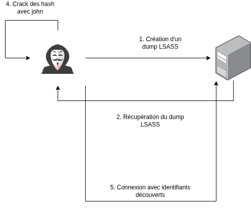
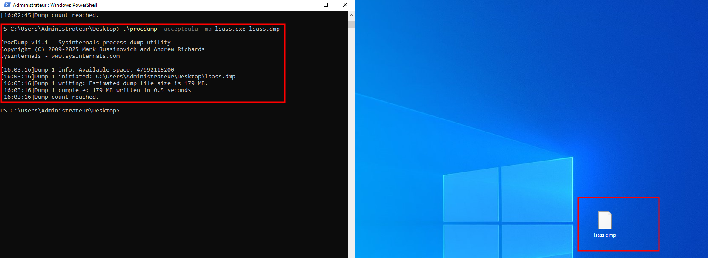
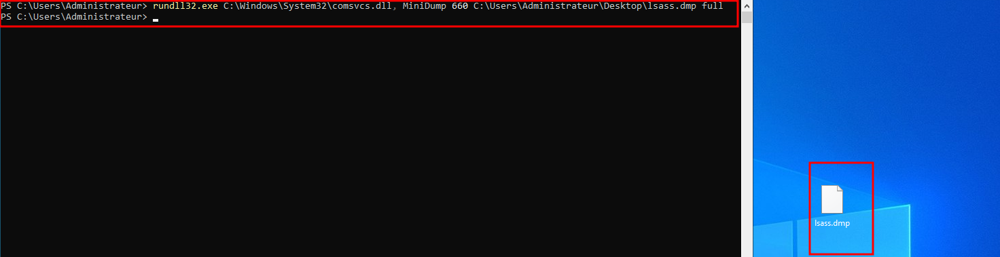
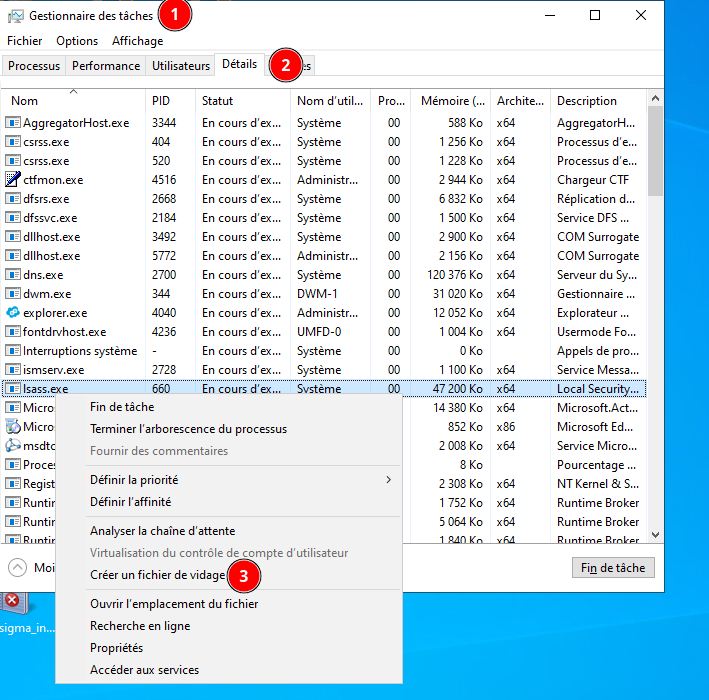
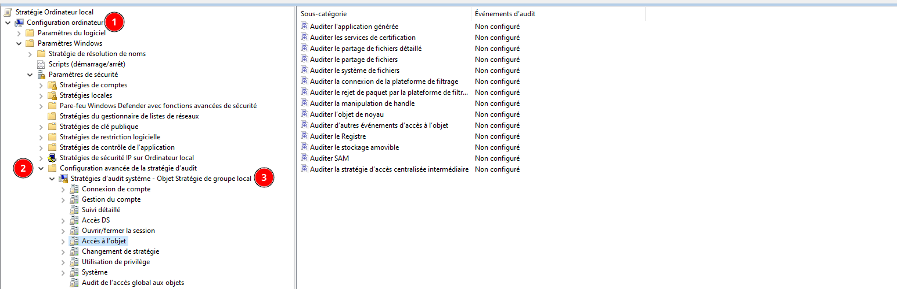
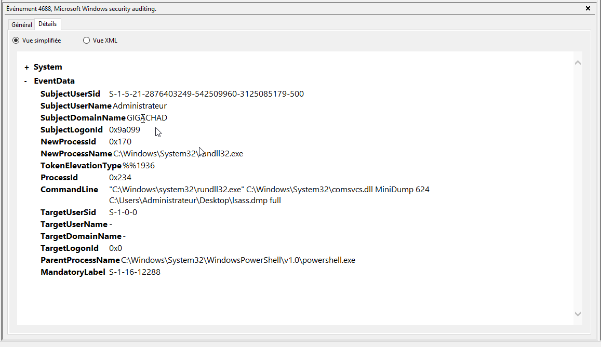
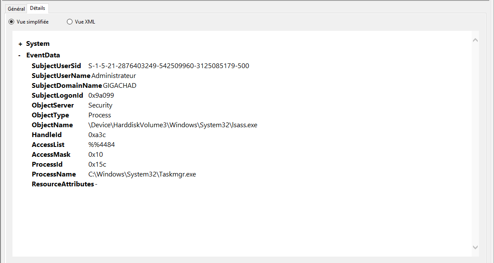

# Contexte 

Dans cet article, nous allons étudier une technique d’attaque largement utilisée lors des phases de post-exploitation : l’extraction des secrets contenus dans le processus LSASS.exe afin d’élever les privilèges sur un système Windows. Nous commencerons par expliquer le rôle de LSASS dans le mécanisme d’authentification Windows et pourquoi ce processus constitue une cible privilégiée pour les attaquants. Nous analyserons ensuite plusieurs méthodes concrètes de dump mémoire, notamment via ProcDump, comsvcs.dll et le Gestionnaire des tâches, afin d’observer les traces laissées sur le système.

L’objectif sera ensuite de comprendre comment détecter ces comportements malveillants à l’aide des journaux Windows et du format SIGMA, un standard ouvert permettant de créer des règles de détection interopérables entre différents SIEM. Nous verrons quels événements Windows doivent être activés, comment analyser les logs générés par ces attaques et comment construire des règles SIGMA capables d’identifier des tentatives d’extraction de LSASS tout en limitant les faux positifs.

Enfin, nous aborderons les limites des mécanismes de détection natifs de Windows, notamment face aux techniques manuelles ou aux outils non conventionnels, ainsi que l’apport de solutions complémentaires comme Sysmon pour améliorer la visibilité et la capacité de détection des équipes SOC.

Lorsqu’un attaquant parvient à s’introduire dans un système informatique, il ne dispose généralement que de droits limités. Pour étendre son contrôle et accéder à des données sensibles, il doit élever ses privilèges, c’est-à-dire obtenir des droits plus élevés, comme ceux d’un administrateur. Cette étape est cruciale dans une attaque, car elle permet de contourner les restrictions et de progresser vers des objectifs plus ambitieux.

L’une des méthodes les plus utilisées, et le sujet de cet article : **l’extraction des secrets via LSASS.exe**.

Le processus **LSASS.exe** (**L**ocal **S**ecurity **A**uthority **S**ubsystem **S**ervice) est un composant central de Windows qui gère les politiques de sécurité locales, notamment l’authentification des utilisateurs. En mémoire, ce processus stocke temporairement des informations sensibles, comme les hachages de mots de passe ou les jetons d’accès. Les attaquants exploitent cette particularité en créant un dump mémoire (une copie instantanée de la mémoire du processus) à l’aide d’outils comme ProcDump. Une fois ce dump récupéré, ils peuvent en extraire les hashes des comptes administrateurs afin de les craquer en local pour les réutiliser afin d'escalader leurs privilèges.


## Un exemple concret : le groupe Earth Lusca
En 2021, lors d’une campagne ciblant des entreprises en Chine, le groupe d’attaquants Earth Lusca a utilisé cette technique pour compromettre des systèmes. Selon une [analyse de Trend Micro](https://www.trendmicro.com/content/dam/trendmicro/global/en/research/22/a/earth-lusca-employs-sophisticated-infrastructure-varied-tools-and-techniques/technical-brief-delving-deep-an-analysis-of-earth-lusca-operations.pdf), les attaquants ont exploité **mimikatz** pour extraire les hashs des mots de passe stockés dans lsass.exe, leur permettant ainsi d’obtenir des droits administrateurs. Cette méthode, bien que connue, reste efficace et largement utilisée, car elle exploite une vulnérabilité inhérente à la gestion des secrets en mémoire.

## Pourquoi cette technique fonctionne-t-elle encore ?
Même si les systèmes modernes intègrent des protections (comme **LSA Protection** ou **Credential Guard**), ces mécanismes ne sont pas toujours activés ou peuvent être contournés dans certaines configurations. De plus, les attaquants adaptent constamment leurs outils pour contourner les défenses. Cela souligne l’importance pour les entreprises de surveiller les accès suspects aux processus sensibles et de renforcer la protection des secrets en mémoire.




## SIGMA : un langage universel pour détecter les attaques

### Pourquoi standardiser la détection des menaces ?
Lorsqu’une équipe de sécurité analyse des logs (journaux d’événements) pour détecter une attaque, elle s’appuie sur des **règles de détection** : des critères précis qui permettent d’identifier des comportements suspects. Cependant, chaque outil de sécurité (comme les **SIEM**, pour *Security Information and Event Management*) utilise souvent son propre format de règles. Cela pose un problème : si une entreprise change de solution ou utilise plusieurs outils en parallèle, elle doit réécrire ses règles à chaque fois, ce qui est chronophage et source d’erreurs.

### SIGMA : un format ouvert et interopérable
C’est ici que **SIGMA** entre en jeu. SIGMA est un **format standardisé et ouvert** qui permet de décrire des règles de détection de manière générique. Ces règles sont rédigées dans un langage simple (basé sur YAML) et peuvent ensuite être **converties automatiquement** pour fonctionner avec la plupart des SIEM du marché (comme Splunk, Elastic, Microsoft Sentinel, etc.).

**Exemple concret :**
Une règle SIGMA pourrait détecter une activité suspecte liée à **LSASS.exe**, comme la création d’un dump mémoire par un outil comme ProcDump. Grâce à SIGMA, cette règle peut être partagée entre différentes équipes ou outils sans avoir à la réécrire.

### Comment SIGMA améliore la détection des attaques ?
1. **Flexibilité** : Les règles SIGMA sont indépendantes des outils, ce qui permet aux équipes de sécurité de les adapter facilement à leur environnement.
2. **Collaboration** : La communauté SIGMA partage des règles prêtes à l’emploi, ce qui accélère la détection de nouvelles menaces.
3. **Précision** : En combinant des règles SIGMA ciblant des comportements spécifiques (comme l’extraction de LSASS) avec d’autres indicateurs, les analystes peuvent identifier des attaques plus rapidement et réduire les faux positifs.

### Lien avec LSASS et la détection des attaques
Dans le cas de l’attaque par dump de **LSASS.exe**, une règle SIGMA pourrait surveiller :
- La création de fichiers de dump (`.dmp`) par des processus non autorisés.
- L’exécution d’outils comme ProcDump sur des processus sensibles.
- Les accès suspects à la mémoire de LSASS.

En intégrant SIGMA à leur arsenal, **les équipes AISI** de sécurité renforcent leur capacité à **détecter, analyser et répondre** aux attaques, même lorsqu’elles exploitent des techniques courantes comme l’élévation de privilèges via LSASS.


# Mise en place du lab et réalisation de l'attaque pour analyse

Pour effectuer cette procédure, nous avons mis en place un Windows Server 2016 avec pour rôle contrôleur de domaine Active Directory. C'est sur ce serveur que les attaques seront effectuées à des fins d'analyses. Il existe plusieurs techniques pour exfiltrer LSASS. Dans le reste de cet article 3 attaques seront effectuées pour obtenir un nombre suffisant d'échantillon comportemental. La première attaque sera via l'utilisation de **procdump**, la seconde sera via l'utilisation de la dll **comsvcs.dll** et enfin la dernière sera effectuée via le **taskmanager**.

## Exécution de l'attaque via PROCDUMP

ProcDump est un utilitaire en ligne de commande développé par **Microsoft Sysinternals**, conçu à l'origine pour aider les administrateurs à diagnostiquer des problèmes. Il permet de **capturer des dumps mémoire** (copies instantanées) d'un processus lors de pics d'activité, afin d'analyser ultérieurement son comportement.

Les attaquants exploitent ProcDump pour **extraire les secrets stockés en mémoire** par le processus **LSASS.exe**. En exécutant une commande comme :

```
procdump.exe -ma lsass.exe lsass.dump
```
Ils génèrent un fichier .dump contenant les hachages de mots de passe ou les jetons d'authentification des utilisateurs. Ces informations peuvent ensuite être utilisées pour **élever leurs privilèges** ou **se déplacer latéralement** dans le réseau.

### Réalisation de l'attaque

Pour réaliser cette attaque, il nous faut télécharger le binaire de [procdump](https://learn.microsoft.com/fr-fr/sysinternals/downloads/procdump) puis, l'exécuter avec l'une des lignes de commandes suivantes :

```
procdump.exe -accepteula -ma lsass.exe lsass.dmp
procdump.exe -accepteula -ma $(tasklist /fi "imagename eq lsass.exe" /fo csv | ConvertFrom-Csv | Select-Object -ExpandProperty "PID") mondump.dmp
```

A la fin de l'exécution, un fichier du nom de lsass.dmp est créé récupérant, les hashes des couples identifiant/mot de passe des utilisateurs.



### Explication de la ligne de commande

-  `-accepteula` : permet d'autoriser automatiquement le contrat de licence de procdump
- `-ma` : permet de créer un dump complet de la mémoire du processus
- `lsass.exe` : le processus cible
- `$(tasklist /fi "imagename eq lsass.exe" /fo csv | ConvertFrom-Csv | Select-Object -ExpandProperty "PID")` : exécute la commande entre parenthèse et utilise la valeur en sortie dans ce cas, permet de récupérer le identifiant du processus (PID) de lsass.exe
- `*.dmp` : le fichier de dump généré par procdump

## Exécution de l'attaque via comsvcs
`Rundll32.exe` est un processus légitime de Windows qui permet de **charger et exécuter des bibliothèques DLL** (Dynamic Link Library). Il agit comme une interface entre les applications et les fonctions système, comme la gestion des entrées/sorties ou l'affichage graphique. Bien que son usage soit normalement inoffensif, il est souvent exploité par les attaquants pour **masquer des activités malveillantes**.

Pour extraire les secrets de **LSASS.exe**, les attaquants utilisent la bibliothèque **comsvcs.dll**, liée aux services **COM+** de Microsoft. Cette DLL contient une fonction exportée appelée **MiniDump**, conçue pour créer des fichiers de dump mémoire d'un processus en cours d'exécution.

Pour générer un dump via MiniDump, il faut exécuter la commande suivante :

``` rundll32.exe C:\Windows\System32\comsvcs.dll, MiniDump <PID de LSASS> C:\chemin\vers\fichier\dump.dmp full ```




## Exécution de l'attaque via le Task Manager
Le **Gestionnaire des tâches** (ou *Task Manager*) est un utilitaire intégré à Windows qui permet de **surveiller et gérer les processus**, les applications et les ressources système en temps réel. Parmi ses fonctionnalités, il offre la possibilité de **créer des fichiers de vidage (dump)** d’un processus en cours d’exécution, une option initialement conçue pour le diagnostic de problèmes techniques.

Les attaquants peuvent passer par le gestionnaire des tâches pour créer un dump de lsass. Cette technique est beaucoup plus simple à exécuter car elle ne nécessite ni téléchargement d'un binaire tiers ni l'exécution de ligne de commande powershell.

Pour exécuter cette attaque, il faut ouvrir le gestionnaire des tâches, puis cliquer sur "Détails", puis faire un clic droit sur lsass et cliquer sur "Créer un fichier de vidage".



# Analyse et création de la règle
Pour analyser les attaques décrites précédemment (comme l'extraction de LSASS via ProcDump, comsvcs.dll ou le Gestionnaire des tâches), il est essentiel de **cibler les bons identifiants d'événements** dans les logs Windows. Ces logs permettent de tracer les actions suspectes et de construire des règles de détection efficaces.

**⚠️ Attention : activation préalable des logs avancés**
Les logs mentionnés dans cet article **ne sont pas activés par défaut** sous Windows. Pour les rendre visibles, il est nécessaire d'activer l'**extension des logs système** via la **Stratégie de groupe locale** (`gpedit.msc`) :

1. **Ouvrir l'éditeur de stratégie de groupe** :
   - Appuyer sur `Win + R`, taper `gpedit.msc`, puis valider.
2. **Naviguer vers les paramètres d'audit** :
   - `Configuration ordinateur` → `Paramètres Windows` → `Paramètres de sécurité` → `Stratégies locales` → `Stratégie d'audit`.
3. **Activer les sous-catégories critiques** :
   - Dans **Stratégies d'audit système**, sélectionner :
     - **Accès à l'objet** :
       - *Auditer l'objet du noyau* → Clic droit → Propriétés → Cocher **"Succès"**.
       - *Auditer d'autres événements d'accès à l'objet* → Cocher **"Succès"**.
       - *Auditer le registre* → Cocher **"Succès"**.
     - **Suivi détaillé** :
       - *Création de processus* → Clic droit → Propriétés → Cocher **"Succès"**.
4. **Appliquer les modifications** et redémarrer si nécessaire.

 

**Pourquoi cette étape est-elle cruciale ?**
Sans ces logs activés, les événements liés aux **accès mémoire**, **créations de processus** ou **modifications du registre** (comme ceux générés par les attaques via LSASS) **ne seront pas enregistrés**. Leur activation permet de **capturer des traces exploitables** pour détecter et analyser les attaques en temps réel.


Les logs pouvant être utilisé pour la création de la règle sont les logs avec l'event ID **4688**.

Selon Microsoft, "ces évènements sont générés lors de chaque démarrage d'un nouveau processus."

En filtrant les logs sur L'event ID **4688**, les alertes apparaissent ainsi que la ligne de commande effectuée ce qui va permettre dans un premier temps de trier les bonnes alertes.



La solution la plus simple serait de mettre la ligne de commande en entier or, la règle ne détecterait qu'un seul comportement. De plus, si un attaquant ajoute des espaces entre les arguments, aucune alerte ne sera levée. Or l'objectif de cette règle est d'être la plus large possible pour détecter le nombre d'attaque sans augmenter le nombre de faux positif.

Après analyse des logs, voici la règle SIGMA avec l'event code ainsi que les valeurs à surveiller.

```
title: Suspicious Process Creation and Access to LSASS
description: Detect unusual process which access to lsass process with the intention to dump it
author: "AISI - Nirina GALLOT"
date: 19/01/2026
level: critical
status: experimental
theat: privilege escalation
tags:
  - attack.credential_access
  - attack.t1003.001
  - detection.behavioral
confidence: 80
logsource:
  provider: kibana
  product: winlogbeat
detection:
  selection_eventcode:
    event.code: 4688
  selection_cmdline:
    CommandLine|re:
      - comsvcs.dll[, ]{1,}MiniDump
      - tasklist.*imagename[ ]{1,6}eq{1,6}lsass.exe
      - accepteula[ ]{1,6}-ma[ ]{1,6}lsass.exe
  condition: selection_eventcode and selection_cmdline
```

Cette règle couvre deux des trois techniques d’attaque mentionnées, à savoir la création de dumps via *rundll32* et *procdump*. Elle présente toutefois une limite importante : si un attaquant recourt à un autre outil, comme *mimikatz*, ou effectue un dump via le gestionnaire des tâches, aucune alerte ne sera déclenchée.

Pour détecter tous les accès au processus lsass, indépendamment du binaire utilisé, il est nécessaire de s’appuyer sur l’event code **4663**. Selon Microsoft, cet événement indique qu’une opération spécifique a été réalisée sur un objet. Il fournit également des détails sur les droits d’accès utilisés, mais ne génère pas d’événements en cas d’échec.



Il faut quand même faire attention avec cet event id car il est très bruyant et donc risque de déclencher des faux positif car beaucoup de binaires légitime de Windows ainsi que les EDRs accédent au processus LSASS mais également LSASS lui-même.

Sur ces bases, voici la seconde règle LSASS permettant de détecter des dumps avec n'importe quel binaire :

```
title: Access to LSASS Memory
description: Detect binary which access to lsass process with the intention to dump it
author: "AISI - Nirina GALLOT"
date: 19/01/2026
level: critical
status: experimental
threat: privilege_escalation
logsource:
  provider: kibana
  product: winlogbeat
tags:
  - attack.credential_access
  - attack.t1003.001
  - detection.behavioral
confidence: 80
detection:
  selection:
    event.code:
      - 4663
    ObjectName|contains:
      - lsass.exe
    ProcessName|re:
      - (.)+
  filter:
    ProcessName|contains:
      - C:\Windows\System32\lsass.exe
      - C:\Windows\System32\wininit.exe
      - C:\Windows\System32\csrss.exe
      - C:\Windows\System32\services.exe
      - C:\Windows\System32\smss.exe
      - C:\Program Files\
      - C:\Program Files (x86)\
  condition: selection and not filter
```

# Test et validation de la règle

Pour tester les règles, il est nécessaire de convertir les règles dans des formats compatibles avec le moteur du SIEM. Il existe de nombreux convertisseurs de signature yaml vers un format adapté au SIEM comme [sigma-cli](https://github.com/SigmaHQ/sigma-cli) ou encore [sigma-to-hayabusa](https://github.com/Yamato-Security/sigma-to-hayabusa-converter).


Puis pour valider la règle, il faut que la règle ait un score de confidence supérieur à 80 (**0\=** que des **faux positifs**", **100\=** que de **vrais positifs**). Cela signifie que la règle a été **testée et ajustée** pour minimiser les alertes erronées, tout en restant efficace pour détecter les **vrais incidents**. Un score élevé garantit que les équipes de sécurité peuvent **faire confiance aux alertes** générées, sans perdre de temps à trier des faux positifs.

# 5. Conclusion et limite actuelle des règles

Pour conclure, la création d’un dump du processus LSASS doit être considérée comme un indicateur critique pour un SOC, car elle peut signaler une tentative de compromission visant l’extraction d’identifiants sensibles.

Aujourd’hui, l’utilisation des mécanismes natifs de Windows permet de détecter la majorité des techniques employées pour réaliser un dump LSASS. Toutefois, les dumps effectués via le gestionnaire des tâches échappent à cette détection, car il s’agit d’actions manuelles constituant un angle mort dans la supervision basée sur les événements natifs du système. Une approche alternative consiste à surveiller la création de fichiers dans le répertoire TEMP. À cet effet, **Sysmon** peut être utilisé : l’événement **11** permet de détecter les créations de fichiers, tandis que l’événement **10** peut aider à identifier les accès au processus LSASS susceptibles d’indiquer un dump.

Exemple de règle SIGMA pour la création d'un fichier de vidage avec le gestionnaire des tâches :

```
title: Task Manager, LSASS DUMP in TEMP Folder Sysmon
description: Detect the creation of a lsass dump file via the task manager
author: AISI - Nirina GALLOT
date: 
logsource:
  product: sysmon

detection:
  selection:
    EventID: 11
    Image: C:\\Windows\\system32\\taskmgr.exe
    TargetFileName|contains: \\AppData\\Local\\Temp\\lsass.DMP
  condition: selection

confidence: 80
level: high
threat: privilege_escalation

```

Le principal inconvénient de Sysmon réside dans le fait qu’il n’est pas nativement intégré à Windows. Son déploiement et sa maintenance doivent donc être assurés sur l’ensemble des actifs concernés. Néanmoins, depuis novembre 2025, Microsoft intègre désormais Sysmon directement dans Windows Server 2025, facilitant ainsi son installation et sa mise à jour.


# Sources

- https://learn.microsoft.com/en-us/previous-versions/windows/it-pro/windows-10/security/threat-protection/auditing/event-4663
- https://research.splunk.com/endpoint/b2fbe95a-9c62-4c12-8a29-24b97e84c0cd/
- https://www.trendmicro.com/content/dam/trendmicro/global/en/research/22/a/earth-lusca-employs-sophisticated-infrastructure-varied-tools-and-techniques/technical-brief-delving-deep-an-analysis-of-earth-lusca-operations.pdf
- https://learn.microsoft.com/fr-fr/windows-server/administration/windows-commands/rundll32
- https://www.deepinstinct.com/blog/lsass-memory-dumps-are-stealthier-than-ever-before
- https://lolbas-project.github.io/lolbas/Libraries/comsvcs/
- https://learn.microsoft.com/fr-fr/sysinternals/downloads/procdump
- https://www.trendmicro.com/content/dam/trendmicro/global/en/research/22/a/earth-lusca-employs-sophisticated-infrastructure-varied-tools-and-techniques/technical-brief-delving-deep-an-analysis-of-earth-lusca-operations.pdf
- https://learn.microsoft.com/fr-fr/sysinternals/downloads/sysmon
- https://www.ultimatewindowssecurity.com/securitylog/encyclopedia/event.aspx?eventid=90010
- https://www.ultimatewindowssecurity.com/securitylog/encyclopedia/event.aspx?eventid=90011
- https://techcommunity.microsoft.com/blog/windows-itpro-blog/native-sysmon-functionality-coming-to-windows/4468112
