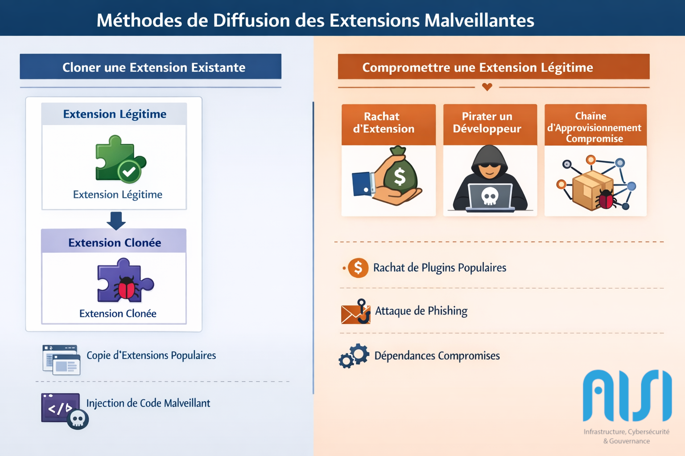
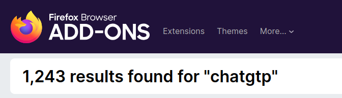
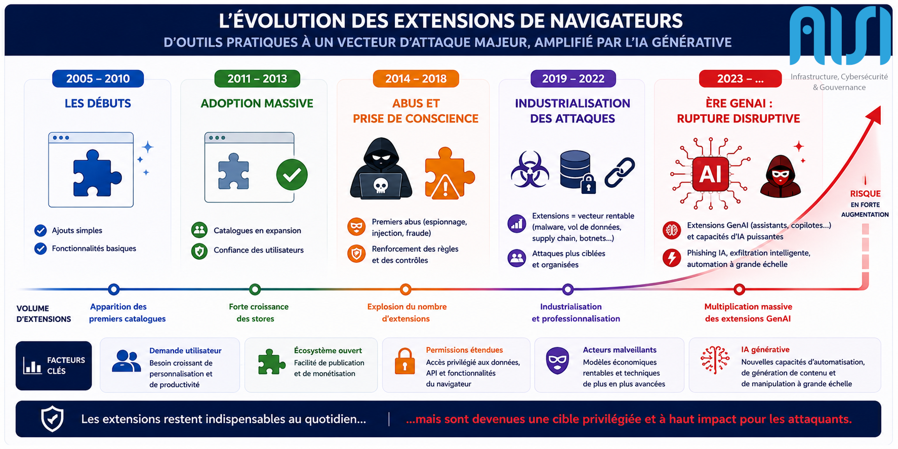
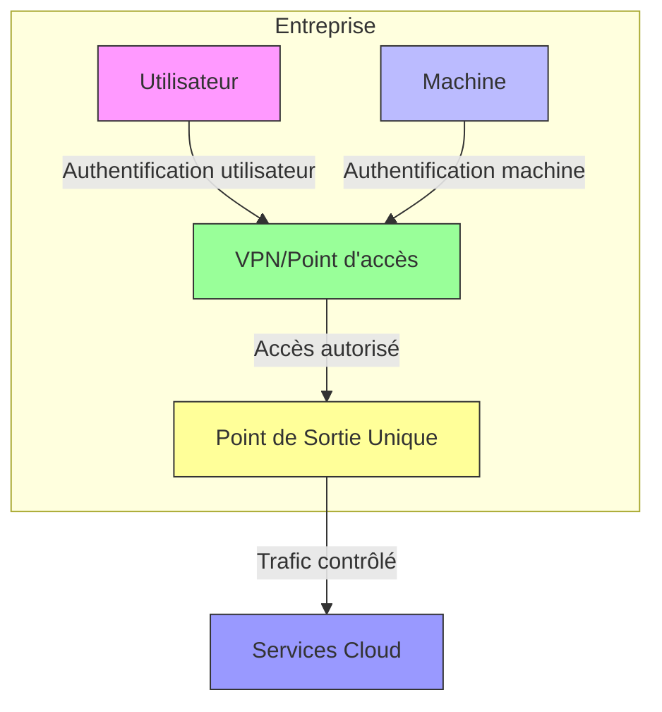

# Introduction

*Les extensions de navigateurs ont-elles aujourd’hui plus de visibilité sur l’activité d’un utilisateur qu’un agent EDR ?*

Les navigateurs web *- Chrome, Firefox, etc.-* et leur structure logiciel *- Electron/Chromium -*   sont aujourd'hui au cœur de tous les usages, personnels et professionnels. Dans les environnements d'entreprise, ils sont devenus un point d’accès central : messageries, applications SaaS, consoles d’administration cloud, environnements de dev (VSCode), voire accès distants via des portails web. 

Dans ce contexte, **les extensions se sont imposées comme des outils indispensables**. Qu’il s’agisse de bloqueurs de publicités, de gestionnaires de mots de passe, d’outils de développement, de solutions de productivité, elles enrichissent considérablement les capacités du navigateur.

Cette omniprésence s’accompagne cependant d’un **élargissement significatif de la surface d’attaque**. Les extensions bénéficient souvent de privilèges étendus sur le contenu des pages et sur les données utilisateurs, ce qui en fait des cibles particulièrement attractives pour les attaquants, tout en restant largement **sous-estimées** du point de vue de la sécurité.

Cet article a pour but d'alerter sur la réalité de cette menace, tout en fournissant des clés de compréhension, ainsi que des conseils et recommandations pratiques. Nous analyserons donc dans un premier temps ces risques et les paradoxes qu'ils contiennent, avant d'étudier l'historique de la menace, et les techniques récentes de diffusion.
Nous conclurons cet article par nos recommandations de sécurité, pour prévenir de ces risques.

# Un angle mort persistant des stratégies de sécurité

La démocratisation de l'utilisation d'extensions de navigateur, malgré le gain de productivité incontestable qu'elle apporte, crée un nouveau point d'entrée de choix pour les attaquants, et expose les utilisateurs comme les entreprises à de nouveaux risques, souvent en dehors des méthodes de détection traditionnelles.

L'importance de ce vecteur n'a fait que croître, et n'a pourtant pas fait l'objet d'avancées majeures en termes de protections créant un écart entre l'usage et la sécurisation de celui-ci.

Plusieurs constats expliquent ce décalage :

- **Un vecteur insuffisamment couvert par les outils de sécurité**  
  Les contrôles de sécurité traditionnels se concentrent historiquement sur la protection des endpoints ou du réseau, sans accorder d'attention particulière aux navigateurs. Une extension opérant dans le navigateur peut observer et manipuler du trafic chiffré avant même qu’il ne soit visible pour des systèmes de détection locaux.

- **Les extensions de navigateur sont rarement remises en question**  
  Quelle proportion d’utilisateurs effectue réellement des revues de sécurité des extensions déjà installées ? Des mises à jour automatiques et invisibles peuvent modifier radicalement leur comportement, transformant une extension initialement légitime en acteur malveillant persistant.

- **Un manque de sensibilisation des utilisateurs**  
  Dans la majorité des organisations, leur utilisation ou approbation ne sont presque jamais encadrées par des chartes ou politiques internes, et la validation des permissions demandées par les extensions se fait souvent sans compréhension réelle des implications.

- **Un faux sentiment de sécurité lié aux stores officiels**  
  Les plateformes de distribution proposent des centaines de milliers d’extensions, et un contrôle exhaustif est inimaginable. Les mécanismes automatiques de validation échouent rapidement face à du code obfusqué, et leurs failles ont de nombreuses fois été démontrées par les différentes campagnes d'extensions malveillantes.

Tous ces éléments font des extensions de navigateur un vecteur privilégié pour les attaquants, en même temps persistant et discret, peu supervisé tout en étant industrialisable.

# Une menace ancienne

Les extensions de navigateurs frauduleuses sont pourtant une très vieille menace, et même si les premières extensions correspondaient plus à des projets personnels qu'à des équipes de développeurs, les premières dérives sont arrivées très tôt.
Le Chrome Web Store, la principale plateforme de distribution d'extensions Chrome, a été lancé en 2010, et c'est peu après que les premières extensions malveillantes ont fait leur apparition.

Depuis, la menace a profondément évolué :
- passage d’initiatives isolées à des campagnes organisées
- structuration d’un véritable écosystème économique
- augmentation massive du nombre d’extensions disponibles
- démocratisation auprès d’utilisateurs non techniques

Des cas emblématiques illustrent cette évolution :
- compromission d’extensions populaires
- rachat d’extensions légitimes suivi d’injection de code malveillant
- utilisation des utilisateurs comme relais (proxy, botnet)
- vol de données et de sessions

Une équipe de l'institut indien de recherche [technologique de Jammu](https://arxiv.org/html/2503.04292v1) a notamment publié en 2025 une liste des cas historiques et attaques marquantes sur le sujet. 

| Extension (Année)                      | Catégorie d'attaque                  | But affiché de l'extension                                             | Détail de l'attaque                                                                                                                                  |
| -------------------------------------- | ------------------------------------ | ---------------------------------------------------------------------- | ---------------------------------------------------------------------------------------------------------------------------------------------------- |
| HoverZoom (2013)                       | Keylogging                           | Permet d'agrandir les images sans visiter le site d'hébergement        | Collecte et revente de l’historique de navigation des utilisateurs à des fins de tracking et de monétisation.                                        |
| Tweet This Page (2014)                 | Injection de contenu                 | Permet de twitter n'importe quelle page consultée                      | Injection de publicités et scripts de suivi dans les pages web visitées. Redirection personnalisée.                                                  |
| Autocopy (2014)                        | Espionnage                           | Sélectionne et copie du texte dans le presse-papier.                   | Envoie les informations vers un serveur C2                                                                                                           |
| Hola Unblocker (2015)                  | DDoS                                 | Permet d'accéder à du contenu bloqué dans le pays                      | Transforme les utilisateurs en proxy botnet et utilise à leur insu leur bande passante.                                                              |
| Marauder’s Map (2015)                  | Géo-Espionnage                       | Suivi de la localisation de vos contacts Messenger                     | Espionnage des contacts en temps réel.                                                                                                               |
| iCalc (2016)                           | Injection de contenu                 | Calculatrice dans le navigateur                                        | Manipulation de trafic via Proxy, récupère des commandes d'un C2                                                                                     |
| Web Developer (2017)                   | Fraude à l'affiliation               | Ajout d'une barre d'outils de développeurs                             | Extension légitime compromise pour injecter des publicités dans les pages web, et rediriger du trafic.                                               |
| Nano Defender Nano Adblocker (2020) | Malware / détournement du navigateur | Bloqueur de publicité                                                  | Rachat d'une extension existante pour injecter du contenu malveillant                                                                                |
| The Great Suspender (2021)             | Malware                              | Mise en pause des onglets inutilisés pour la performance du navigateur | Distribution de malware suite à un changement de propriétaire d'une extension populaire. (Extension de mise en pause d'onglet pour des performances) |
| SessionManager (2022)                  | Vol de  données                      | Enregistre la session et l'état des onglets                            | Vol des cookies de sessions                                                                                                                          |
| Sakula Rat (2023)                      | RAT                                  | /                                                                      | Installé de manière malveillante pour permettre un contrôle à distance du navigateur et de la machine.                                               |
| Cyberhaven (2024)                      | Supply-Chain                         | Protection et classification des données                               | Compromission des comptes développeurs par phishing, vol des données d'authentification, tokens et cookies                                           |
| AdSkimmer Pro (2024)                   | Publicité invasive                   | Bloqueur de publicités                                                 | Injection de ses propres publicités contenant des pages et liens affiliés                                                                            |
| QuickAccess Helper (2024)              | Phishing                             | Promets un accès plus rapide aux sites habituels                       | Redirige les utilisateurs vers des sites de phishing volant les données d'authentification.                                                          |

Ces nombreuses attaques au cours de l'histoire indiquent clairement le décalage entre ces nouveaux vecteurs et le manque de prise de conscience des utilisateurs. 

# Un changement d’échelle récent

Les tendances observées ces dernières années marquent une véritable rupture dans l’évolution de cette menace. Là où les extensions malveillantes relevaient historiquement d’initiatives opportunistes, on observe désormais des campagnes structurées, outillées et pensées pour passer à l’échelle.

Plusieurs indicateurs permettent de mesurer ce changement d’échelle :

- Dès 2022 [Kaspersky](https://www.kaspersky.com/about/press-releases/13-million-users-encountered-browser-extension-threats-in-the-first-half-of-2022) avait identifié plus de 1,3 million d'utilisateurs exposés à des extensions malveillantes, ou détournées lors de campagnes
- Selon [LayerXSecurity](https://go.layerxsecurity.com/hubfs/LayerX_Enterprise_Browser_Extension_Security_Report_2025.pdf) en 2025, plus de 53 % des utilisateurs en entreprise disposent d’au moins une extension à risque 

Ces chiffres nous montrent que les extensions de navigateurs sont devenues un point de plus en plus privilégié par les attaquants. Cet écosystème des extensions est devenu un vecteur d'attaque à part entière, avec des volumes et des impacts désormais comparables à d'autres vecteurs d'accès initial largement exploités par les attaquants, comme le phishing ou la réutilisation de comptes présents dans des fuites de données.

Des compromissions d'extensions à plusieurs centaines de milliers d'utilisateurs sont publiées chaque semaine, tout en impliquant des capacités de persistance et d'exécution beaucoup plus avancées que ces autres vecteurs initiaux.

## Industrialisation des techniques de diffusion
Ce changement d'échelle est aussi mis en lumière par l'évolution des techniques de diffusion des charges malveillantes.
Afin de toucher autant de monde, les attaquants s'appuient sur des méthodes de diffusion qui ont fait leur preuve, tout en étant standardisées et industrialisables.

### Cloner une extension existante

L’une des plus simples approches, et donc des plus répandues consiste à cloner une extension existante, souvent populaire, en y injectant du code malveillant. 
Ces copies reprennent l’interface, les fonctionnalités et parfois même les descriptions originales, rendant leur identification difficile pour un utilisateur non averti. Dans certains cas, seules quelques lignes de code suffisent à ajouter des capacités d’exfiltration ou de manipulation de contenu, tout en conservant un comportement globalement conforme aux attentes.
D'ailleurs dans la majorité des cas analysés, les extensions ne comportent pas de charge malveillante lors de leur mise en ligne. Celle-ci est ajoutée petit à petit, plus tard.

Cette technique connaît en ce moment un intérêt croissant, avec l'essor des extensions de productivité basées sur l'IA, où leur distinction est devenue beaucoup plus complexe.

Pour illustrer ce propos, je vous encourage à chercher "ChatGPT" ou Traduction, dans le "store" public de votre choix : 
https://chromewebstore.google.com/search/chatgpt
https://addons.mozilla.org/en-US/firefox/search/?q=chatgtp
https://microsoftedge.microsoft.com/addons/search/ChatGPT

Il existe, lorsque j'écris cet article, plusieurs centaines d'extensions (par exemple plus de 1200 chez Mozilla) dont, pour l'immense majorité, auront une interface similaire, des fonctionnalités similaires, et un code source, là aussi, profondément similaire. 

Et même si un certain nombre de ces extensions sont légitimes, possèdent les droits d'utilisation de la marque déposée, et n'ont pas de comportement suspect. Ce n'est pas le cas de toutes les extensions affichées.

### Compromettre une extension légitime

La seconde méthode de distribution de la menace consiste à réutiliser une extension légitime. Cette approche est particulièrement efficace car elle s’appuie sur une base d’utilisateurs déjà existante et sur un capital confiance déjà établi.

Cette méthode peut être réalisée de plusieurs manières, comme observé lors des attaques de CyberHaven ou de Nano Defender. Les techniques consistent principalement à :

- **Racheter une extension existante**  (Nano Defender / Nano Adblocker)
  Des développeurs indépendants cèdent leurs extensions, parfois populaires, à des tiers. Une fois le contrôle acquis, les nouveaux propriétaires publient des mises à jour intégrant du code malveillant. Ce changement est généralement invisible pour l’utilisateur, qui conserve l’extension installée et à jour.

- **Compromettre un studio de développement d'extensions** (Cyberhaven)
  Par le biais de campagnes de phishing ou de compromission de comptes, les attaquants prennent le contrôle des accès permettant de publier des mises à jour. Ils peuvent alors injecter du code malveillant dans une extension légitime, sans modifier son apparence ou sa réputation dans le store.

- **Compromission d'une chaîne d'approvisionnement**  
  Au même titre que les autres applications, les extensions de navigateurs reposent souvent sur de nombreuses dépendances externes, et ne sont pas épargnées par les compromissions à large échelle permettant d'introduire du code malveillant via ces dépendances. La différence étant que certaines extensions étant très peu maintenues, les paquets compromis persistent davantage.

## L’émergence des extensions basées sur l’IA

L’intégration massive de fonctionnalités d’intelligence artificielle en tant qu'extensions de navigateur a profondément modifié le paysage des menaces. En quelques mois, des milliers d’extensions se sont positionnées comme assistants à la rédaction, outils de résumé, copilotes de navigation ou interfaces vers des modèles de langage.

Et ce changement n'est pas anodin du point de vue sécurité, ces usages nécessitent de pouvoir lire le contenu des pages, et ce surtout, sans avoir de restrictions précises sur les sites qu'elles peuvent analyser.

LayerXSecurity a publié dans ses chiffres de 2025, que 20% des utilisateurs utilisent des extensions basées sur des outils IA dites "GenAI".

Ils ont aussi identifié que certaines autorisations permissives sont plus régulièrement utilisées avec ces outils GenAI.  La permission "scripting" qui donne les droits à l'API chrome correspondante (pouvoir exécuter des scripts arbitrairement dans les pages webs), est deux fois plus utilisée pour les extensions GenAI que pour les autres.
23.92% contre 14,34 habituellement.

Cette évolution d'échelle s'accompagne donc aussi d'un changement de la nature, les permissions historiquement sensibles deviennent peu à peu normales et de nombreuses extensions légitimes présentent maintenant des comportements très intrusifs, rendant significativement plus dur de distinguer les extensions légitimes des extensions illégitimes. 

Enfin, l'expansion des extensions malveillantes sur l'IA "GenAI" peut aussi être illustrée par la recrudescence d'articles et documents de recherches sur le sujet en 2026, réalisés par de nombreux autres éditeurs.

| Date de l'article | Catégorisation / Type d'attaque           | Editeur           | Lien de l'article                                                                                                      |
| ----------------- | ----------------------------------------- | ----------------- | ---------------------------------------------------------------------------------------------------------------------- |
| 26/01/2026        | 16 extensions malveillantes               | LayerxSecurity    | https://layerxsecurity.com/blog/how-we-discovered-a-campaign-of-16-malicious-extensions-chatgpt/                       |
| 23/02/2026        | Extension malveillante / Injection        | Annex Security    | https://annex.security/blog/pixel-perfect/                                                                             |
| 02/03/2026        | Extension compromise / Exfiltration       | GBHackers         | https://gbhackers.com/pixel-perfect-browser-extension/                                                                 |
| 02/03/2026        | Session hijacking / LLM abuse             | Palo Alto Unit 42 | https://unit42.paloaltonetworks.com/gemini-live-in-chrome-hijacking/?utm_source=cybersecuritynews                      |
| 03/03/2026        | Exploitation de vulnérabilité / Hijacking | GBHackers         | https://gbhackers.com/chrome-gemini-vulnerability/                                                                     |
| 05/03/2026        | Extension malveillante / Exfiltration LLM | Microsoft         | https://www.microsoft.com/en-us/security/blog/2026/03/05/malicious-ai-assistant-extensions-harvest-llm-chat-histories/ |
| 09/03/2026        | Fake extension / Phishing / Exfiltration  | GBHackers         | https://gbhackers.com/fake-ai-extensions/                                                                              |
| 24/03/2026        | Infostealer / Vol de session              | Expel             | https://expel.com/blog/on-the-radar-chatgpt-stealer/                                                                   |
| 28/03/2026        | Extension malveillante / Injection JS     | GBHackers         | https://gbhackers.com/malicious-browser-extensions-2/                                                                  |

Ces nombreuses publications montrent également une accélération nette de la sophistication des attaques. Là où les extensions malveillantes visaient historiquement le vol d’identifiants ou de cookies, les campagnes récentes analysées mettent désormais en œuvre des mécanismes bien plus avancés : injection dynamique de code, interception de conversations avec des LLM, détournement de sessions authentifiées ou encore exfiltration de données issues d’outils d’IA générative.

Par leur volume, leurs similitudes avec des extensions légitimes et l’évolution des usages des utilisateurs, ces extensions malveillantes deviennent également plus difficiles à identifier. Elles restent ainsi actives plus longtemps, augmentant mécaniquement leur persistance et l’impact potentiel des compromissions associées.

# Impacts concrets pour l’entreprise

Les capacités techniques des extensions leur permettent donc d’accéder directement à des données critiques, souvent avant même que les mécanismes de sécurité traditionnels ne puissent intervenir.  
Elles opèrent au plus près de l’utilisateur, dans le navigateur lui-même, là où transitent identifiants, contenus métiers et interactions avec le système d’information.

Contrairement à une idée encore répandue, leur périmètre ne se limite pas à des fonctionnalités périphériques : une extension disposant de permissions trop étendues peut lire, modifier du contenu dynamiquement et exécuter du code sur l’ensemble des pages consultées.

Les risques associés incluent notamment :
- vol d’identifiants et de sessions authentifiées
Les extensions peuvent accéder aux cookies de session, aux jetons OAuth ou aux champs de formulaires. Cela permet de détourner des sessions actives sans nécessiter de mot de passe, contournant ainsi les mécanismes MFA dans certains cas.
- exfiltration de données issues d’applications SaaS
- interception et modification de contenus affichés
- redirection vers des sites frauduleux
- fraude à l’affiliation et détournement de flux
- collecte d’informations sensibles à l’insu des utilisateurs

Dans un contexte professionnel, ces risques se traduisent par :

- fuite de données stratégiques
- accès initial d'une compromission
- pertes financières
- exposition réglementaire (RGPD, conformité)

# Recommandations de sécurité

Face à ce constat, AISI recommande plusieurs mesures structurantes pouvant être mises en place à l’échelle d'une organisation afin de réduire significativement cette surface d'exposition.
La première repose sur une gouvernance stricte des extensions autorisées, en définissant une liste blanche exhaustive, et en interdisant par défaut les extensions non validées.
Cette liste blanche doit s'accompagner d'un processus de revue de sécurité, avant autorisation, ainsi que d'un processus permettant aux utilisateurs de demander l'approbation d'une nouvelle extension.

Nous recommandons d'interdire l'usage d'extensions sur les environnements sensibles, les postes T1 et T0, et tous les postes dont la compromission pourrait provoquer des impacts critiques.
Nous recommandons de bannir la présence ou l'utilisation de navigateurs sur les serveurs.

Le contrôle et la différenciation des usages représentent aussi un axe majeur. Afin de limiter l'import et la persistance d'extensions vulnérables ou illégitimes, AISI recommande de proscrire les synchronisations entre les environnements personnels et professionnels. 

Enfin, la sensibilisation des utilisateurs reste essentielle, notamment sur les risques associés.

| Domaine                                 | Mesures recommandées                                                                                                                                                                                                                               |
| --------------------------------------- | -------------------------------------------------------------------------------------------------------------------------------------------------------------------------------------------------------------------------------------------------- |
| Gouvernance                             | Définir une liste blanche exhaustive d’extensions autorisées Interdire par défaut toute extension non validée Mettre en place un processus de revue de sécurité avant validation Intégrer le navigateur comme un composant critique du SI |
| Protection des environnements sensibles | Interdire les extensions sur les postes à privilèges élevés (T0 / T1) [sous VSCode](https://code.visualstudio.com/docs/enterprise/extensions) ou sur [Chrome](https://support.google.com/chrome/a/answer/9296680?hl=fr) 
 Interdire les extensions sur les serveurs ([voir doc](https://learn.microsoft.com/fr-fr/deployedge/microsoft-edge-manage-extensions-policies))  |
| Contrôle des usages                     | Empêcher et interdire la synchronisation entre environnements personnels et professionnels via une [architecture à point de sortie unique](#architecture-renforcée)                                                                                                                                                       |
| Sensibilisation                         | Sensibiliser les utilisateurs aux risques liés aux permissions                                                                                                                                                                                     |

Même si les méthodes d’accès initial ou les impacts évoluent avec l’émergence des extensions GenAI, les mécanismes d’investigation et d’endiguement restent largement comparables à ceux déjà rencontrés dans les opérations de réponse à incident dites "classiques".

Les analyses de persistance, l'identification d'accès compromis et la recherche d'exfiltration de données restent des fondamentaux pleinement applicables. 
La mise en place de politiques de sécurité strictes ne remplace pas une expertise opérationnelle, pouvant réagir en cas de comportement suspect.

# Annexes
## Architecture renforcée
Une architecture à point de sortie unique est une architecture qui intègre : 
* Une accès aux services Cloud via des sorties contrôlées par l'entreprise (Forced Egress / IP Whitelisting)
* Une double authentification au système d'information (interne ou via VPN) : 
    * Authentification machine via certificat
    * Authentification utilisateur via identifiant/mot de passe ou certificat

Cette architecture permet de limiter l'accès aux services Cloud aux machines de l'entreprise connues et de confiance.

## Références
Attaques sur les navigateurs : https://cdn.builder.io/o/assets%2Ff3a1111ff5be48cdbb123cd9f5795a05%2F18836a2b5990433cabf1e9eaac50df34?alt=media&token=b2fe32c4-b4b5-4ec7-be21-d6b237d9f075&apiKey=f3a1111ff5be48cdbb123cd9f5795a05

Statistiques d'extensions : https://www.aboutchromebooks.com/chrome-extension-ecosystem/

1.3 millions d'utilisateurs impactés : 
https://www.kaspersky.com/about/press-releases/13-million-users-encountered-browser-extension-threats-in-the-first-half-of-2022

Statistiques de Layerxsecurity : https://go.layerxsecurity.com/hubfs/LayerX_Enterprise_Browser_Extension_Security_Report_2025.pdf

Lancement du chrome extension webstore : https://arstechnica.com/information-technology/2010/12/hands-on-a-look-at-googles-chrome-web-store/

## Historique de la menace :

https://arxiv.org/html/2503.04292v1

| Extension                              | Liens                                                                                                                                                                                                              |
| -------------------------------------- | ------------------------------------------------------------------------------------------------------------------------------------------------------------------------------------------------------------------ |
| HoverZoom (2013)                       | https://www.reddit.com/r/YouShouldKnow/comments/1wjrc8/ysk_that_the_hover_zoom_extension_is_spyware/ https://www.ghacks.net/2013/12/26/hoverzooms-malware-controversy-imagus-alternative/                       |
| Tweet This Page (2014)                 | https://www.theguardian.com/technology/2014/jan/20/google-malware-twitter-feedly-chrome-browser                                                                                                                    |
| Hola Unblocker (2015)                  | https://bestreviews.net/three-years-after-the-controversy-what-is-the-current-state-of-hola/                                                                                                                    |
| Marauder’s Map (2015)                  | https://uk.pcmag.com/social-media/42258/stalk-facebook-messenger-friends-with-creepy-extension                                                                                                                     |
| iCalc (2016)                           | https://www.malwarebytes.com/blog/news/2016/01/rogue-google-chrome-extension-spies-on-you                                                                                                                          |
| Nano Defender Nano Adblocker (2020) | https://arstechnica.com/information-technology/2020/10/popular-chromium-ad-blockers-caught-stealing-user-data-and-accessing-accounts/                                                                              |
| SessionManager (2022)                  | https://thierryvanoffe.com/chrome-fin-de-the-great-suspender/?srsltid=AfmBOoowM2A00zQT8HpGMUnhFCztcjRjfTD-HDf2Eql1tLmisvJHRjUT                                                                                     |
| Sakula Rat (2023)                      | https://www.sophos.com/fr-fr/research/sakula-malware-family                                                                                                                                                        |
| Cyberhaven (2024)                      | https://www.bleepingcomputer.com/news/security/new-details-reveal-how-hackers-hijacked-35-google-chrome-extensions/ https://www.darktrace.com/blog/cyberhaven-supply-chain-attack-exploiting-browser-extensions |
| Honney                                 | https://www.youtube.com/watch?v=vc4yL3YTwWk                                                                                                                                                                        |

## Analyses actuelles :

| Date de l'article | Catégorisation / Type d'attaque           | Editeur           | Lien de l'article                                                                                                      |
| ----------------- | ----------------------------------------- | ----------------- | ---------------------------------------------------------------------------------------------------------------------- |
| 26/01/2026        | 16 extensions malveillantes               | LayerxSecurity    | https://layerxsecurity.com/blog/how-we-discovered-a-campaign-of-16-malicious-extensions-chatgpt/                       |
| 17/02/2026        | Agent-to-agent / Supply chain IA          | Straiker          | https://www.straiker.ai/blog/built-on-clawhub-spread-on-moltbook-the-new-agent-to-agent-attack-chain                   |
| 23/02/2026        | Supply chain via agents IA                | SecurityWeek      | https://www.securityweek.com/autonomous-ai-agents-provide-new-class-of-supply-chain-attack/                            |
| 23/02/2026        | Extension malveillante / Injection        | Annex Security    | https://annex.security/blog/pixel-perfect/                                                                             |
| 02/03/2026        | Extension compromise / Exfiltration       | GBHackers         | https://gbhackers.com/pixel-perfect-browser-extension/                                                                 |
| 02/03/2026        | Session hijacking / LLM abuse             | Palo Alto Unit 42 | https://unit42.paloaltonetworks.com/gemini-live-in-chrome-hijacking/?utm_source=cybersecuritynews                      |
| 03/03/2026        | Exploitation vulnérabilité / Hijacking    | GBHackers         | https://gbhackers.com/chrome-gemini-vulnerability/                                                                     |
| 05/03/2026        | Extension malveillante / Exfiltration LLM | Microsoft         | https://www.microsoft.com/en-us/security/blog/2026/03/05/malicious-ai-assistant-extensions-harvest-llm-chat-histories/ |
| 09/03/2026        | Fake extension / Phishing / Exfiltration  | GBHackers         | https://gbhackers.com/fake-ai-extensions/                                                                              |
| 24/03/2026        | Infostealer / Vol de session              | Expel             | https://expel.com/blog/on-the-radar-chatgpt-stealer/                                                                   |
| 28/03/2026        | Extension malveillante / Injection JS     | GBHackers         | https://gbhackers.com/malicious-browser-extensions-2/                                                                  |
