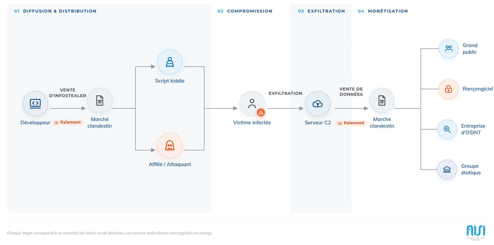
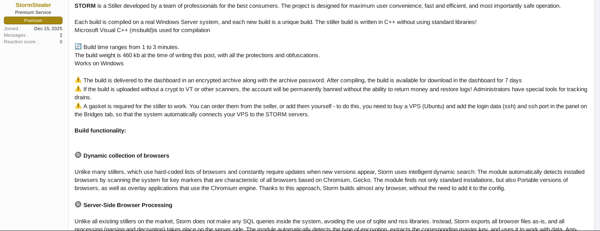
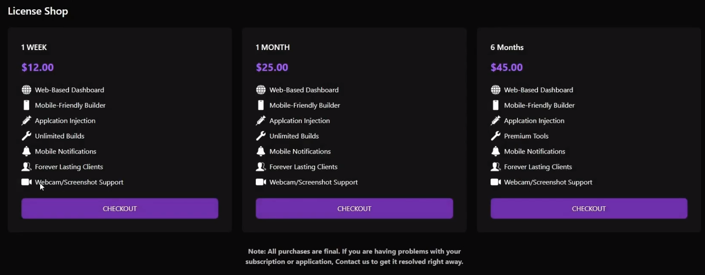
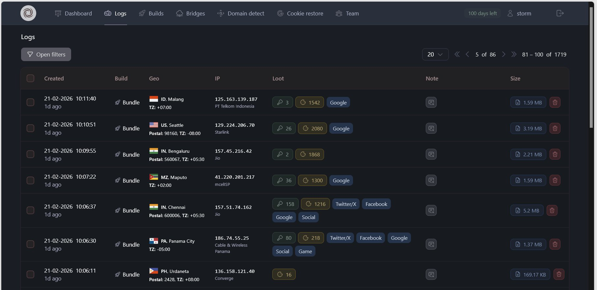
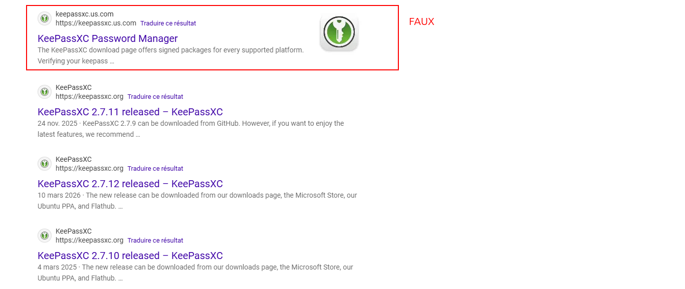
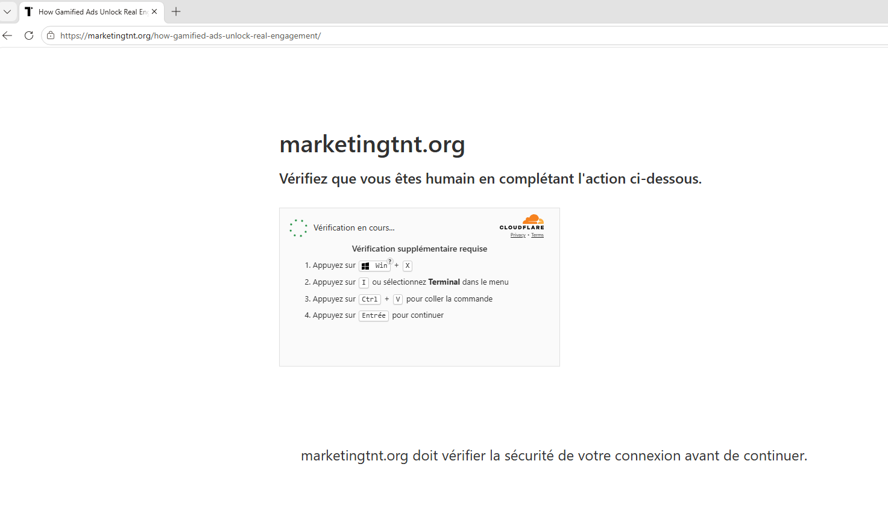
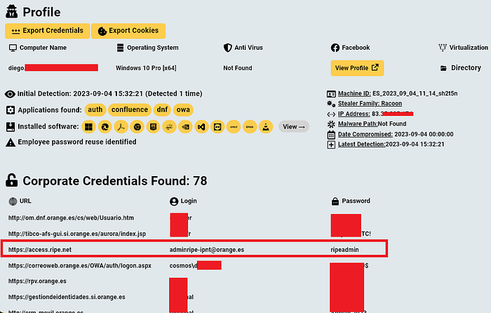
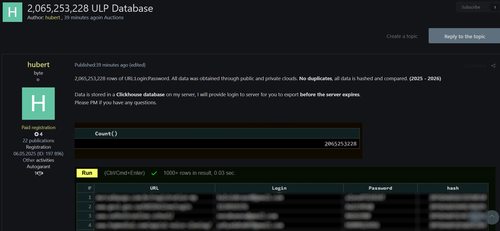
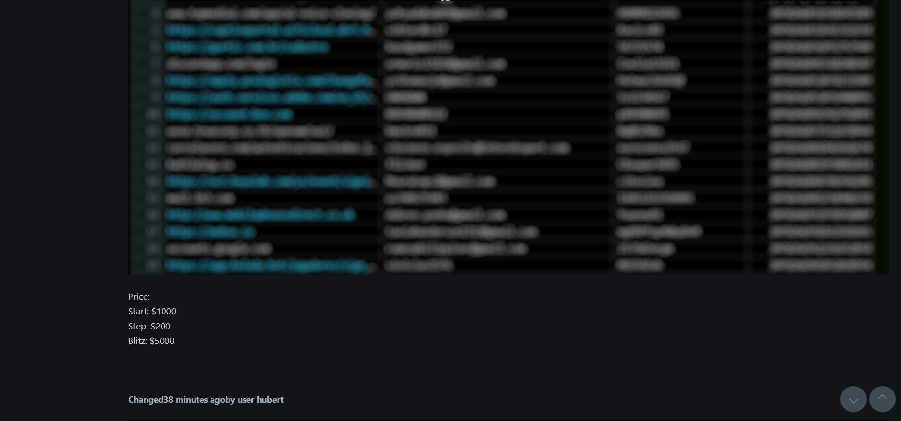
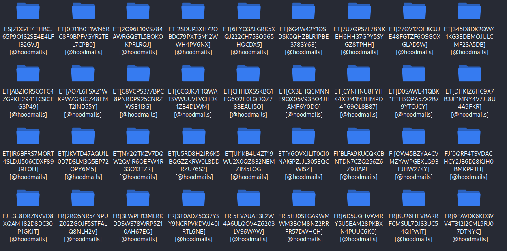

# Infostealer: tout un écosystème

## Introduction

Notre équipe **DFIR** remarque une montée en nombre des compromissions où l'attaquant arrive avec des identifiants valides.
Des **identifiants VPN valides**, permettant à l'attaquant d'avoir directement un pied sur le système d'information de sa victime, sans aucune trace d'attaque par brute force.
Ce constat nous a poussé à approfondir le sujet, comprendre d'où proviennent ces identifiants valides, comment les groupes d'attaquants se les procurent et à quel prix.
Au fil de nos recherches, nous avons découvert un véritable écosystème concurrentiel, où les développeurs rivalisent pour proposer les infostealers les plus performants et où les stratégies marketing sont omniprésentes, comme dans n'importe quel secteur d'activité.
Enfin, nous allons proposer quelques bonnes pratiques permettant de limiter le risque de **vols de données**.

## Infostealer

Les **Infostealers** sont souvent considérés comme juste un logiciel qui va aller voler des logins / mot de passe sur une machine. 
Leur écosystème a évolué pour tendre vers un modèle économique similaire au **Malware-as-a-Service (MaaS)** ou au **Ransomware-as-a-Service (RaaS)**.
Un **Infostealer** en 2026 est principalement vendu sous forme d'abonnement, avec de multiples fonctionnalités.

Parmi les familles les plus actives et documentées à ce jour, on retrouve notamment **Lumma Stealer**, **RedLine**, **Vidar**, **StealC** ou encore **Raccoon Stealer**.



Un **Infostealer** vendu sur ce marché dispose de plusieurs fonctionnalités : 
- Vol d'identifiants
- Collecte des données des navigateurs
- Extraction de portefeuilles de cryptomonnaies
- Extraction d'information de carte de crédit dans les navigateurs
- Effectuer des captures d'écran
- Collecte d'information système
- Collecte d'information réseau
- Récupérer des clés de licences de jeux vidéo installés sur la machine
- Rechercher des fichiers spécifiques en fonction des extensions (.pdf, .docs, .kdbx, .env, ...)
- Collecter des données de messagerie et de communication
- Extraire des configurations VPN, FTP
- Exfiltrer les données
- Installer un outil de contrôle à distance (RAT) sur la machine

Ces fonctionnalités correspondent à plusieurs techniques bien documentées dans le référentiel **MITRE ATT&CK**, notamment **T1555** (Credentials from Password Stores), **T1539** (Steal Web Session Cookie), **T1005** (Data from Local System), **T1113** (Screen Capture) et **T1071** (Application Layer Protocol) pour l'exfiltration vers l'infrastructure du développeur.

Pour bien comprendre comment fonctionnent les infostealers, il est essentiel de comprendre le rôle que joue chaque acteur de cet écosystème.


## L'écosystème

### Le développeur

**Le développeur** est le premier acteur de cet écosystème. C'est lui qui écrit le code source des logiciels infostealer, propose de nouvelles fonctionnalités et surtout, met tout en œuvre pour que son infostealer ne soit pas détecté par les solutions de sécurité telles que les EDR (Endpoint Detection and Response) et les antivirus.

Les développeurs font généralement eux-mêmes le marketing de leurs produits, proposent un support 24/7 et définissent un plan de mise à jour bien rodé. 
La vente d'infostealer se fait principalement sur des sites web du **Darkweb** ou sur **Telegram**

La capture d'écran suivante montre une annonce d'un développeur d'infostealer pour vendre son logiciel depuis un site web du **Darkweb**



Dans cette capture d'écran, on voit que le développeur insiste sur le fait de ne pas envoyer l'infostealer directement sur VirusTotal sans être chiffré, cela faciliterait le travail des défenseurs qui cherchent à mettre en place des signatures pour détecter ce genre de logiciel malveillant.

**Le développeur** peut proposer son logiciel selon un modèle d'abonnement ou sous la forme d'une licence vendue en une seule fois.



Contrairement aux développeurs d'autres types de malwares, qui cherchent généralement à rester discrets, les développeurs d'infostealers n'hésitent pas à se faire connaître afin de promouvoir leurs produits. Ils proposent même, dans certains cas, un service d'assistance disponible 24 h/24 et 7 j/7. Cette proximité avec leur clientèle leur permet de maintenir un contact continu avec les acheteurs et de recueillir rapidement leurs retours. En conséquence, les infostealers font l'objet de mises à jour fréquentes afin de rester compétitifs et de conserver leur efficacité face à l'évolution des mécanismes de défense, tels que les EDR (Endpoint Detection and Response) et les antivirus.

**Les développeurs** d'infostealer proposent aussi une interface web pour visualiser les victimes et récupérer facilement les données volées, comme le montre l'image suivante.



### Les distributeurs

J'appelle **Les distributeurs** l'ensemble des acteurs qui achètent les infostealers auprès des développeurs pour les distribuer via des attaques de :

+ **Phishing** (MITRE ATT&CK **T1566**) : via des services ou plateformes de phishing telles que **EvilProxy**
+ **Logiciels compromis ou packagés** (**T1195** - Supply Chain Compromise) : via des logiciels légitimes qui embarquent des scripts ou des logiciels malveillants pour installer l'infostealer.
+ **Malvertising** (**T1189** - Drive-by Compromise) : via des pubs sur internet comme **Google Ads**, incitant à télécharger et installer des logiciels compromis qui embarquent des infostealers.
+ **Faux CAPTCHA**, technique aujourd'hui largement documentée sous le nom de **ClickFix** (**T1204.004** - Malicious Copy and Paste) : via des systèmes de faux CAPTCHA qui incitent les utilisateurs à copier-coller puis exécuter des commandes d'installation d'infostealer à l'insu de la victime.

Nous avons remarqué une montée en nombre des compromissions suite à l'installation de logiciel compromis poussé par des pubs en ligne.

Sur une recherche simple du logiciel "Keepass" sur Google, nous avons dans les résultats un faux site parmi la liste des résultats.



Le téléchargement depuis ces faux sites malveillants installe à la fois le logiciel attendu et un logiciel malveillant, qui s'exécute de manière silencieuse à l'insu de l'utilisateur. De nombreux infostealers sont diffusés selon ce mode opératoire.

Une autre méthode de diffusion, très répandue et fréquemment rencontrée au cours de nos investigations, repose sur l'utilisation de faux sites de vérification de CAPTCHA, technique communément appelée **ClickFix** dans la communauté CTI. Ces sites demandent à la victime de copier, coller puis exécuter une commande afin de prouver qu'elle est bien un être humain et non un robot. Présentée de cette manière, l'attaque peut sembler facilement identifiable. En réalité, ces sites sont conçus de manière très convaincante et reproduisent fidèlement l'apparence de services légitimes. Les commandes à exécuter sont présentées comme faisant partie de la procédure de vérification, si bien que la victime ne perçoit généralement aucun caractère malveillant lorsqu'elle les exécute.




Nous avons fait une classification globale des distributeurs d'infostealer :

+ **Les "Script kiddie"** : ce sont des acteurs individuels, avec ou sans connaissance poussée en informatique. 
+ **Les affiliés** : ce sont des acteurs plus professionnels, avec des connaissances en informatique, qui disposent de plusieurs infrastructures de phishing, malvertising et faux CAPTCHA.


### Les victimes infectées

J'appelle **Les victimes infectées** toute personne ayant une machine infectée par un infostealer.

Une victime peut avoir sa machine personnelle et/ou professionnelle infectée. Dans les deux cas, le risque sur ses comptes professionnels est tout aussi élevé car une personne peut réutiliser le même mot de passe sur son environnement professionnel et personnel, ou même sauvegarder des identifiants de comptes professionnels sur une machine personnelle.

Un exemple concret, comme décrit dans l'article de **infostealers.com**, un infostealer qui a infecté la machine personnelle d'un employé, sur laquelle des identifiants admin d'une plateforme professionnelle étaient présents.



***Image de Hudson Rock’s Cavalier platform***

### La monétisation

La monétisation autour des infostealers se fait principalement par : 
+ La vente des infostealers en un seul paiement ou en abonnement
+ La vente des données volées.

Dans les deux cas, la vente se passe généralement sur des forums du **Darkweb** ou des channels **Telegram**.

Dans la capture d'écran suivante, un acteur vend **2 065 253 228** couples **URL:Login:Password (ULP)**, en précisant qu'aucune donnée n'est dupliquée et que les données datent de **2025-2026**. Ce chiffre illustre la montée en puissance du nombre d'infostealers installés sur des machines victimes.



Le plus intéressant reste le prix : comparé aux gains que peuvent générer les groupes de ransomware, souvent estimés selon plusieurs rapports de threat intelligence à des centaines de milliers, voire des millions d'euros par victime, investir quelques milliers d'euros pour obtenir un accès initial via des logs infostealer représente un investissement largement rentable du point de vue d'un attaquant.



## Les logs bruts

Comme précisé au tout début de l'article, les infostealers ne collectent pas que les identifiants / mot de passes. Nous nous sommes procurés des logs bruts afin d'identifier la nature des données volées par les logiciels d'infostealer.

Dans les logs bruts qu'on a pu récupérer, chaque machine d'une victime est représentée par un dossier nommé avec l'ID du pays et l'ID de la victime.




La structure des logs ressemble globalement à la structure suivante :

```
.
├── Autofill
│   ├── Microsoft Edge_Default.txt
│   └── Opera_Default.txt
├── Cookies
│   ├── Google Chrome_Default.txt
│   ├── Microsoft Edge_Default.txt
│   └── Opera_Default.txt
├── Files
│   └── Desktop
│       ├── FORMATION
│       │   ├── Guide des Métiers de l'Electrotechnique
│       │   │   └── Lisez moi.txt
│       │   └── Guide des Sciences et Techniques
│       │       ├── DC Motors.txt
│       │       ├── Lisez moi.txt
│       │       └── Motor Circuits.txt
│       ├── mtkclient-main
│       │   └── Tools
│       │       ├── da_info.txt
│       │       ├── mmc_init.txt
│       │       └── mmc_only_init.txt
│       ├── TFTUnlock-2024-v6.2.1.1
│       │   ├── bypass_utility.log
│       │   └── port_trace.txt
│       ├── venus_global_images_V13.0.6.0.SKBMIXM_20230119.0000.00_12.0_global
│       │   └── images
│       │       ├── anti_version.txt
│       │       └── elf_path.txt
│       ├── VG Mobile Service Tool5.1
│       │   └── Mi Canal de Youtube.txt
│       └── VG Tool v4.1
│           └── Keygen.zip
├── GoogleAccounts
│   └── Google Chrome_Default.txt
├── History
│   ├── Google Chrome_Default.txt
│   ├── Microsoft Edge_Default.txt
│   └── Opera_Default.txt
├── information.txt
├── Passwords
│   ├── Google Chrome_Default_login_data_for_account.txt
│   ├── Google Chrome_Default_passwords.txt
│   └── Opera_Default_passwords.txt
├── passwords.txt
├── Soft
│   ├── Discord
│   │   └── tokens.txt
│   ├── Steam
│   │   ├── config.vdf
│   │   ├── DialogConfigOverlay_1920x1080.vdf
│   │   ├── DialogConfig.vdf
│   │   ├── libraryfolders.vdf
│   │   └── loginusers.vdf
│   └── Telegram
│       └── tdata
│           ├── 0A4228A84A831C2As
│           ├── 2E4C37421E450BE9s
│           ├── 9B157AF448CCB71As
│           ├── D877F783D5D3EF8C
│           │   ├── BD9B5CF444753E94s
│           │   ├── FD9A661B050E8756s
│           │   └── maps
│           ├── D877F783D5D3EF8Cs
│           ├── key_datas
│           └── settingss
├── url_uniq_cookies.log
├── url_uniq_history.log
├── url_uniq_passwords.log
└── Wallets
    └── MetaMask
        └── Microsoft Edge
            └── Default
                └── Local Extension Settings
                    ├── 011344.ldb
                    ├── 011345.ldb
                    ├── 011346.log
                    ├── 011347.ldb
                    ├── CURRENT
                    ├── LOG
                    ├── LOG.old
                    └── MANIFEST-000001

29 directories, 53 files
```

Le dossier **Autofill** contient toutes les informations auto-completées dans un navigateur. Cela peut être une adresse email, un nom, un prénom, une adresse postale ou tout autre information que la victime renseigne souvent dans son navigateur et qui est auto-complétée.

Dans notres exemple, nous avons pu avoir les informations suivantes dans les **Autofill** de la victime.

```
data[email] b**********@gmail.com
data[username] b******
data[firstName] r****
data[lastName] l******
data[city] rennes
data[address] 16 rue du ******** 35580
data[zip] 35580
data[telephone] 07********
data[city] guignen
username bra**********zi@gmail.com
companyName g********
cityName g******
postCode 35580
phoneNumber 07********
```

Le dossier **Cookies** contient les différents cookies de navigation de la victime

```
.unlockcell3.webnode.page       TRUE    /       TRUE    0       PHPSESSID       e*******************************
unlocktoolpro.com       FALSE   /       FALSE   0       PHPSESSID       8***************************
.google.com     TRUE    /       TRUE    1805932808      __Secure-3PSIDCC        AKE******************************-*****************************d6uxfteMu9E
.youtube.com    TRUE    /       TRUE    1805932939      __Secure-3PSIDTS        sidts-******************************************
.youtube.com    TRUE    /       TRUE    1805932939      __Secure-3PSIDCC        AKE************************************1-_oy************LhPuQ

```

Le dossier **Files** contient tous les fichiers intéressants que l'infostealer a trouvé sur la machine. Généralement ce sont des fichiers qui contiennent des mot de passes, des clés d'activation de logiciel ou de licences d'application.

```
└── Desktop
    ├── FORMATION
    │   ├── Guide des Métiers de l'Electrotechnique
    │   │   └── Lisez moi.txt
    │   └── Guide des Sciences et Techniques
    │       ├── DC Motors.txt
    │       ├── Lisez moi.txt
    │       └── Motor Circuits.txt
    ├── mtkclient-main
    │   └── Tools
    │       ├── da_info.txt
    │       ├── mmc_init.txt
    │       └── mmc_only_init.txt
    ├── TFTUnlock-2024-v6.2.1.1
    │   ├── bypass_utility.log
    │   └── port_trace.txt
    ├── venus_global_images_V13.0.6.0.SKBMIXM_20230119.0000.00_12.0_global
    │   └── images
    │       ├── anti_version.txt
    │       └── elf_path.txt
    ├── VG Mobile Service Tool5.1
    │   └── Mi Canal de Youtube.txt
    └── VG Tool v4.1
        └── Keygen.zip
```

Le dossier **GoogleAccounts** contient de `refresh tokens` Google, permettant ainsi d'avoir une persistance sur les comptes compromis.

```
1//**********************************************************************QTgmk:1********************
1//**********************************************************************8_YQg:1********************
```

Le dossier **History** contient les histiques de navigation des différents navigateurs installés sur la machine
```
├── Google Chrome_Default.txt
├── Microsoft Edge_Default.txt
└── Opera_Default.txt
```

Le contenu des fichiers est sous le format suivant : 

```
https://tv.garden/
https://support.microsoft.com/fr-fr/training
https://ai.invideo.io/workspace/********-****-****-****-**********f5/home
https://hdqwalls.com/
https://chat.deepseek.com/
https://connect.easi-training.fr/#/login
https://btwe3.com/
https://portableapps.com/download
https://www.xbox.com/fr-FR/play
https://koyso.to/download/1022
https://anime-sama.org/catalogue/one-piece/saison10/vf/

```

Le fichier **information.txt** contient les informations générales sur la machine, on y trouve le chemin d'installation de l'infostealer, sa version installée, les informations sur le hardware de la machine (CPU, RAM, GPU) et l'antivirus ou l'EDR installé sur la machine.

```

=====================================================
*           HOOD MAILS: *************               *
=====================================================

I    0  F6$b   bHOt  yDnI     X       7    S    &r1em g       TP2 
G    x X    E ?    L 3   v    i r   X a   d .     t   p      g   o
5iMpBl 5    q q    O M    s   2   z   z  b$v$V    s   n       s   
@    q $    q 2    G x   I    M       S T     K   p   J    T   P  
g    p  ojBD   4UzD  1rjH     D       q *     . xniIa MUJQ  %TM   

- FREE HOOD MAILS Build: Dec 11 2025
- Configuration: ******.***/hoodmails
- Path: C:\Users\******\AppData\Local\Temp\IXP548.TMP\50c840.exe

- OS Version: Windows 10
- Local Date: 22.03.2026 08:16:28
- Time Zone: UTC+2
- Install Date: 24.03.2026 13:18:27
- Elevated: false
- Computer: DESKTOP-*******

T    Z  ikjS   %f@1  9LjJ     k       Y    c    YbMt@ N       6iC 
k    k J    f 1    % L   I    A E   m X   U z     u   M      X   M
5uh9qf .    % K    z S    J   O   E   e  mHAjV    t   J       t   
&    K &    p 5    L u   f    k       T @     j   S   K    7   &  
z    2  dF2b   #hhd  .g$c     g       y T     7 v?qly $zOs  KCH   

=====================================================
*           HOOD MAILS: *************               *
=====================================================

- User: ******
- Domain: WORKGROUP
- Hostname: DESKTOP-*******
- NetBIOS: DESKTOP-*******
- Language: English
- Anti Virus:
        - Windows Defender
- HWID: 003AC0E08F99F85B6A55-529893f1-dc74
- RAM Size: 32716 MB
- CPU Vendor: GenuineIntel
- CPU Name: Intel(R) Core(TM) i7-7700HQ CPU @ 2.80GHz
- CPU Threads: 10
- CPU Cores: 16
- GPU:
        - @hoodmails
        - @hoodsupbot
- Display resolution: 1920x1080

- IP Address: 127.0.0.1
- Time: 24.03.2026 03:31:49
- Country: FR
```

Le fichier **passwords.txt** contient tous les trios ULP (URL;LOGIN;PASSWORD) volées
```
r    F  X?gI   v&RS  X7$6     w       y    S    7x.#K J       mr3 
Q    i J    $ B    6 s   Q    8 6   * @   1 y     @   h      &   K
0wXXcu Z    U k    g 4    K   j   6   8  MvR7M    2   p       n   
f    3 ?    r M    e E   b    5       N o     A   *   c    B   3  
a    k  i6WD   FVqD  tGyr     *       # Q     P Gtq4M C9Tn  fN3   

=====================================================
*           HOOD MAILS: *************               *
=====================================================


Soft: Google Chrome (Default)
Host: https://my.account.sony.com/
Password: *******

Soft: Google Chrome (Default)
Host: https://m.fr.dhgate.com/
Login:*******
Password: *******

Soft: Google Chrome (Default)
Host: https://www.q8trade.com/
Login: *******
Password: *******

Soft: Google Chrome (Default)
Host: https://boutique.canal.fr/
Password: *******

Soft: Google Chrome (Default)
Host: https://appleid.apple.com/
Login: *******
Password: *******

Soft: Google Chrome (Default)
Host: https://souscrire.boursorama.com/
Login: *******
Password: *******
```

Le dossier **Soft** contient les données d'applications volées.

```
├── Discord
│   └── tokens.txt
├── Steam
│   ├── config.vdf
│   ├── DialogConfigOverlay_1920x1080.vdf
│   ├── DialogConfig.vdf
│   ├── libraryfolders.vdf
│   └── loginusers.vdf
└── Telegram
    └── tdata
        ├── 0A4228A84A831C2As
        ├── 2E4C37421E450BE9s
        ├── 9B157AF448CCB71As
        ├── D877F783D5D3EF8C
        │   ├── BD9B5CF444753E94s
        │   ├── FD9A661B050E8756s
        │   └── maps
        ├── D877F783D5D3EF8Cs
        ├── key_datas
        └── settingss
```

Enfin, le dossier **Wallets** contient les données des portefeuilles cryptomonnaies volées
```
└── MetaMask
    └── Microsoft Edge
        └── Default
            └── Local Extension Settings
                ├── 011344.ldb
                ├── 011345.ldb
                ├── 011346.log
                ├── 011347.ldb
                ├── CURRENT
                ├── LOG
                ├── LOG.old
                └── MANIFEST-000001
```

Tout cela montre qu'un infostealer sur une machine peut récupérer toute l'identité de sa victime :
+ Nom
+ Prénom
+ Adresse
+ Numéro de téléphone 
+ Numéro de carte bleue enregistré sur la machine
+ Document d'identité enregistré sur la machine
+ Les différents mots de passe enregistrés sur la machine
+ Les clés ou licences d'application
+ Des informations sur les portefeuilles cryptomonnaies
+ Des informations sur les gestionnaires de mot de passe installés sur la machine
+ L'historique de navigation
+ Les cookies de navigation

Un infostealer ne vole pas juste des identifiants et des mots de passe : il vole toutes les identités et informations personnelles présentes sur une machine.

## Cartographie MITRE ATT&CK

Pour synthétiser l'ensemble de la chaîne d'attaque décrite dans cet article, voici une cartographie des tactiques et techniques **MITRE ATT&CK** associées à l'écosystème infostealer, depuis la diffusion initiale jusqu'à la revente des données.

| Tactique | Outils / Vecteurs observés | Technique |
|---|---|---|
| Initial Access | Phishing, plateformes telles qu'**EvilProxy** | Phishing – T1566 |
| Initial Access | Malvertising (**Google Ads**) | Drive-by Compromise – T1189 |
| Initial Access | Logiciels compromis ou packagés | Supply Chain Compromise – T1195 |
| Initial Access | Faux CAPTCHA (**ClickFix**) | User Execution: Malicious Copy and Paste – T1204.004 |
| Execution | Commande copiée-collée dans PowerShell / `cmd` | Command and Scripting Interpreter: PowerShell – T1059.001 |
| Credential Access | Navigateurs (Chrome, Edge, Opera) | Credentials from Password Stores – T1555 |
| Credential Access | Cookies de session (dossier **Cookies**) | Steal Web Session Cookie – T1539 |
| Credential Access | Fichiers de configuration VPN / FTP | Unsecured Credentials: Credentials In Files – T1552.001 |
| Collection | Fichiers, documents, wallets (dossiers **Files**, **Wallets**) | Data from Local System – T1005 |
| Collection | Captures d'écran | Screen Capture – T1113 |
| Collection | Regroupement des logs avant envoi | Archive Collected Data – T1560 |
| Command and Control | Bots **Telegram** | Web Service: Bidirectional Communication – T1102.002 |
| Exfiltration | Canal Telegram / infrastructure du développeur | Exfiltration Over C2 Channel – T1041 |
| Exfiltration | Protocole applicatif de l'infostealer | Application Layer Protocol – T1071 |
| Resource Development | Revente de logs et d'accès sur forums **Darkweb** / **Telegram** | Acquire Access – T1650 |

Cette cartographie illustre bien que l'infostealer n'intervient que sur la première partie de la chaîne (accès initial, collecte, exfiltration) : c'est ensuite la revente de ces accès qui alimente des impacts bien plus lourds, notamment des attaques par ransomware.

## Recommandations


Nous recommandons les actions suivantes pour éviter la compromission par un infostealer :

1. **Télécharger uniquement depuis les sources officielles.** Évitez les logiciels piratés, cracks, fausses mises à jour et installateurs proposés par des publicités ou des résultats de recherche sponsorisés.

2. **Ne jamais exécuter une commande dictée par un site.** Une page vous demandant de lancer PowerShell, Terminal, `cmd`, Exécuter, ou de coller une commande pour « valider un CAPTCHA » est très probablement malveillante.

3. **Travailler sans droits administrateur.** Utilisez un compte standard au quotidien et un compte administrateur séparé uniquement lorsqu’une installation légitime l’exige.

4. **Utiliser des mots de passe uniques.** Stockez-les dans un gestionnaire de mots de passe reconnu, protégé par une phrase secrète robuste et un verrouillage automatique. Ne laissez pas le coffre ouvert en permanence.

5. **Préférer les passkeys ou clés physiques de sécurité.** À défaut, activez une application d'authentification multifacteur (MFA - Multi-Factor Authentication). C'est préférable au SMS. Attention : la MFA classique limite les dégâts liés au vol du mot de passe, mais ne protège pas toujours contre un cookie de session déjà dérobé. 

6. **Réduire les données accessibles au navigateur.** Évitez d’y enregistrer les cartes bancaires et autres informations sensibles. Limitez les extensions, supprimez celles qui sont inutiles et vérifiez leur éditeur.

7. **Séparer les usages sensibles.** Utilisez des profils distincts, voire des appareils distincts, pour le travail, l’administration, la banque, les cryptomonnaies et les loisirs. Ne connectez pas de comptes professionnels sur un ordinateur familial non maîtrisé.

8. **Rester prudent face aux pièces jointes et aux urgences artificielles.** Méfiez-vous des archives ZIP, images disque, raccourcis, exécutables et documents demandant d’activer des macros. Vérifiez une demande inhabituelle par un autre canal.

## Pistes de détection côté DFIR

Au-delà des bonnes pratiques utilisateur, notre équipe **DFIR** recommande de surveiller côté EDR/SIEM certains artefacts caractéristiques d'une infection par infostealer :

+ Exécution de processus depuis des répertoires temporaires (`%TEMP%`, `AppData\Local\Temp`) suivie d'un accès en lecture massif aux profils de navigateurs (`Login Data`, `Cookies`, `Web Data`).
+ Copier-coller suivi de l'exécution immédiate d'une commande PowerShell ou `cmd` via la boîte de dialogue « Exécuter », signature typique d'un scénario **ClickFix**.
+ Connexions réseau sortantes vers des bots **Telegram** ou des domaines nouvellement enregistrés, souvent utilisés comme canal d'exfiltration (**T1071**).
+ Création d'archives compressées temporaires regroupant plusieurs profils applicatifs juste avant une connexion sortante (schéma de collecte puis exfiltration en une requête).
+ Présence de connexions ou de sessions actives depuis des adresses IP ou des user-agents inhabituels peu après l'infection présumée, révélatrices d'une réutilisation rapide des identifiants volés par l'attaquant.

Ces éléments viennent compléter les règles de détection basées sur les EDR et antivirus, dont l'efficacité reste limitée face à des infostealers régulièrement mis à jour par leurs développeurs pour échapper aux signatures existantes.

## En cas de suspicion

Depuis **un autre appareil considéré comme sain** :

+ déconnectez l’appareil suspect du réseau
+ révoquez toutes les sessions actives des comptes
+ changez d’abord les mots de passe de la messagerie et du gestionnaire de mots de passe, puis ceux des autres comptes ;
+ régénérez les clés API, secrets, codes de récupération et clés crypto présents sur la machine ;
+ contrôlez les règles de transfert de messagerie, appareils connectés et opérations bancaires ;
+ faites analyser la machine, appelez l'équipe DFIR AISI 😉

Changer les mots de passe **depuis la machine potentiellement infectée** est à éviter : l’infostealer pourrait voler immédiatement les nouveaux identifiants.

## Conclusion

Les infostealers ne sont plus de simples logiciels isolés : ils s'appuient sur un véritable écosystème économique, structuré autour de développeurs, de distributeurs et de circuits de monétisation bien rodés, au même titre que d'autres familles de cybercriminalité comme le ransomware. Cette professionnalisation explique la montée en puissance des compromissions par identifiants valides que nous observons sur le terrain, souvent bien plus discrètes et difficiles à détecter qu'une attaque par force brute.

Face à cette menace, aucune mesure isolée n'est suffisante : c'est la combinaison d'une hygiène numérique côté utilisateurs et d'une capacité de détection outillée côté équipes sécurité qui permet de limiter le risque et l'impact d'une compromission.

Notre équipe **DFIR** reste mobilisée pour accompagner les organisations confrontées à ce type de menace, de la détection à la remédiation.
